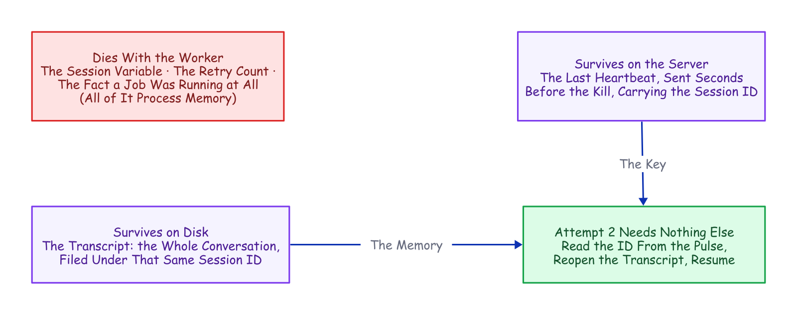
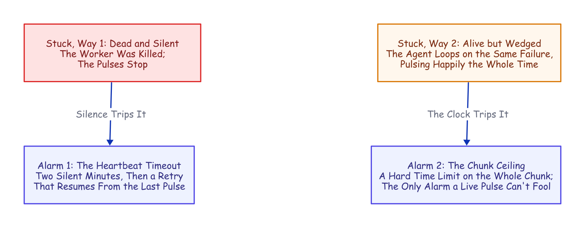
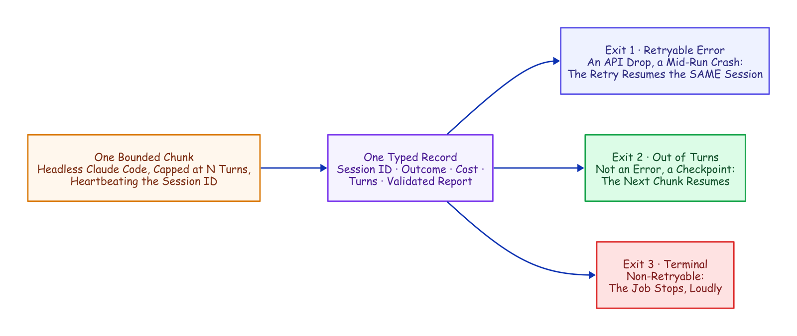
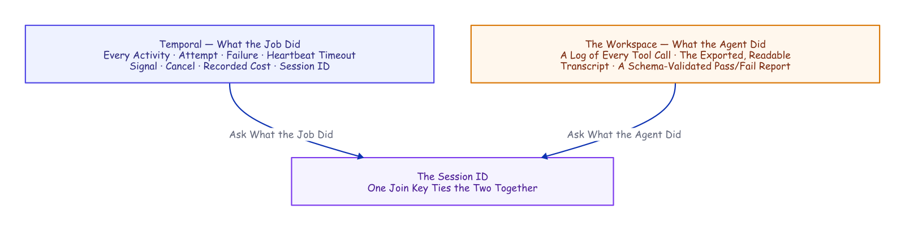

# A Crash-Proof Team of Coding Agents

### Claude Code remembers the conversation; Temporal remembers the job. Kill the worker mid-task and the agent finishes anyway: the same session, resumed from its last heartbeat rather than any saved checkpoint. This is what durability buys when one coding agent becomes a governed team.

---


There is a moment in every infrastructure demo where you stop trusting the slides and ask the presenter to pull the plug. We opened this project by pulling it ourselves.

The setup was ordinary on purpose. A worker process was running a headless coding agent (headless meaning one command in a terminal, no chat window) on a small test-first Python task, and the agent was minutes in, actively writing files, nothing finished, nothing saved anywhere. We killed the worker's entire process tree with an unblockable signal. No goodbye, no flush, no checkpoint. For about two minutes, nothing happened at all. Then a different process on a restarted worker noticed the silence, picked up the same half-finished conversation, and ran it to completion: the same session, remembering everything it had learned, for a total bill of four cents. The staged kill is just the legible version of what happens uninvited every week: an API overload, a rate limit, a deploy that restarts the worker.

That is the durability half of this article, and it is the smaller half of the story, though it takes the most telling. The bigger half is what durability buys once you have it: a durable *team*. The work is split into single-purpose durable jobs. Only one kind of step runs Claude Code itself, and it does all the judgment work: building the feature, reviewing the diff, resolving the conflict. The rest carry the delivery pipeline around it, each job governed by playbooks it actually follows and rules re-asserted before every slice of work. That team carried a filed GitHub issue all the way to a merged pull request, resolving a real merge conflict along the way, with no human decision in the loop. (One mechanical asterisk, footnoted where that story is told.)

*The fine print, up front: one engineer ran everything here, and the "we" is editorial. Every measured run used `haiku`, Claude's cheap fast tier, in July and August 2026; the run counts are single-digit, so every number is a point estimate that traces to a results file in the companion evidence repository. Dollar figures are haiku-priced; a stronger tier scales them up. And "crash-proof" here means process and worker crashes, the staged kill included; a machine that never comes back is an admitted gap, covered in What This Doesn't Solve.*

## Claude Code Is Already Half a Durable System

Run Claude Code headless and it executes the whole agent, prints a result, and exits. The result carries a **session ID**: hand it back later with a resume flag and the agent reopens that exact conversation, because the transcript is an ordinary file on disk, filed under the directory the agent ran in. The *conversation* is already durable. Nor is this a toy mode: the official GitHub Action ships the same headless agent into continuous integration to review pull requests and fix failing checks.¹,²

It also ships a real guardrail harness, which matters the moment you hand an agent a shell. Dangerous commands (deleting a tree, escalating privileges, pushing to a remote) are denied by the tool itself rather than discouraged in a prompt. Hooks fire around every tool call, one before it runs that can veto it and one after that records what happened. The operating system sandboxes what the process can touch, and a required output schema shapes what the agent must return.³ A line in a prompt is a suggestion; a deny rule is a fact, identical on the first attempt and the sixth.

That is one half of a durable system, the hard, conversational half. The other half its own documentation concedes: a resumed session is local to the machine and directory it was born in. There is no way to move it, no lease, nothing that notices the machine died and carries the work elsewhere.⁴ The agent remembers the conversation. **Nothing remembers the job.**


*Half a Durable System. The job (the thing that would notice a dead machine and move the work) is the piece left on the floor. Color key, used across this family: indigo = the durable machinery · amber = judgment (agent or human) · purple = the durable record · green = a good exit · red = failure · dashed = crosses a team or a poll boundary.*

## The Job Is the Half That Dies

The obvious way to drive a headless agent is a loop. Ask it to continue, refresh the session ID from the result, ask it to continue again:

```bash
while :; do claude -p "continue" --resume "$SID" --max-turns 6; done
```

The real thing parses each run's output to keep the session ID current, but that is the shape. Two terms fall out of it that the rest of this article leans on. A **turn** is one round of the agent's loop: one model reply plus the tool calls it makes, so `--max-turns 6` stops the run after six rounds. And each capped run is a **chunk**, a bounded slice of the session that stops cleanly with its transcript intact. The loop works right up until the process holding it dies. And when that process dies, exactly one thing survives, because it is a file on disk: the transcript. Everything else was memory. The current session ID. The retry count. The instruction someone typed an hour ago. The bare fact that a job was running at all.

An agent run is exactly the kind of job you cannot afford to forget. It runs for hours and bills by the token, it carries context a fresh start cannot get back (the explored codebase, the failed approaches, the half-written fix), and because it runs unattended against real systems, it fails at two in the morning, in exactly the state you least want to reconstruct from logs. Try to remember all of this yourself and the shopping list writes itself: durable state, a single-writer lock, a retry taxonomy, a liveness probe, a status endpoint. Somewhere around the third item you are hand-building a distributed system you never meant to own. (A session ID in a SQLite row under a process supervisor buys the first item cheaply; it is the rest of the list that compounds.) Or you can give the job the one thing the conversation already has: a record that outlives the process.

## The Missing Half Has a Name

Strip the agent out of that hand-built list and what remains (durable state, one writer, retries, liveness, visibility) is not an AI problem at all. It is the standard checklist for any long job that must outlive its own hardware, and the industry has a name for the answer: **durable execution**. Temporal, the engine we used, grew out of a system built at Uber for exactly these long, crash-prone jobs.⁵

The core move is a refusal to trust process memory. A database does not keep your data safe by keeping its process alive; it writes every change to a log and rebuilds after a crash by replaying it. Durable execution does the same for *program control flow*: every step a job takes is appended to a ledger on the server, the **event history**, and when the process dies, a new one reads the ledger back and continues from exactly where the job was.


*Durable Execution. The ledger, not the process, is where the job lives: any other worker replays it and picks up mid-job. No memory snapshot required.*

The reconstruction is **deterministic replay**: re-run the job's code from the first line, substituting the recorded result at every step that already happened. Same code, same inputs, same decisions, same state. The catch lives in the word *same*: one clock reading, one coin flip, one network call in the replayed layer, and the replay diverges from its own history.

That constraint forces a clean split, and four plain words carry the rest of this article:

- A **workflow** is the code that decides what a job does next: the deterministic, replayable layer, the part that must never flip a coin.
- A **worker** is an ordinary process on some machine that physically does the work, and it is meant to be mortal; that is the whole trick.
- An **activity** is a single step the engine treats as a sealed box: it may call the network, write files, roll dice, anything, because its insides are never replayed, and it retries under a policy you declare rather than code.
- A **heartbeat** is a small liveness pulse a running step sends, and it may carry a little data with it. If the pulses stop for too long, the server declares that attempt dead and starts a retry that can read the last pulse the dead attempt sent.⁶

That last capability (a retry that can read the dead attempt's final heartbeat) is the mechanism the rest of this design rests on.

## Put the Agent Where Non-Determinism Is Legal

One problem looks fatal at first. A workflow has to be deterministic, and an AI coding agent is the least deterministic software you will ever run: same prompt, different transcript, every time. Put the agent inside workflow code and the first replay diverges on the first token. That is a category error, not a knob you can tune.

But durable execution already has a room where non-determinism is not just tolerated but expected: the activity. Seal the entire agent inside an activity and the workflow never sees the chaos. All it sees is what crosses back as plain data (a session ID, an outcome, a dollar cost, a validated pass/fail report), and its own logic collapses to something a database could run: read a typed result, decide *continue or stop*, repeat.


*The Seam. The workflow stays replayable because the agent is sealed inside an activity; only typed data crosses the line.*

Two details make resume survive that boundary. First, each run gets one stable working directory derived from the job's identity, so every attempt lands in the same folder. And because the agent files its transcript under the directory it ran in, landing in the same folder is exactly what lets a retry find the conversation again. Second, the workflow always chains forward the latest session ID an activity hands back, because a resume can mint a fresh one. The job's ledger stores a *pointer* into the conversation's transcript, and that pointer is very nearly the entire integration.

## Recovering a Crashed Run from Its Last Heartbeat

This is where the sealed box earns its place, and the whole mechanism fits on a clock.

1. **Every thirty seconds**, a timer inside the activity pulses the server: *still alive, and the session ID is `698c…`*. The timer is deliberately dumb: it fires on the clock, not on the agent's output, so a long silent tool call (a slow test suite, a dependency install) cannot be mistaken for death.
2. **Kill the worker** and the pulses stop. Nothing was returned; nothing was saved.
3. **Two silent minutes later**, the server declares the attempt dead and schedules a retry on a live worker (in this demo the same worker, restarted, because the transcript lives on that machine's disk; the sticky-queue default near the end of this article makes that landing deliberate).
4. **The retry reads the dead attempt's last pulse**, takes the session ID out of it, and relaunches the agent with a resume. The agent reopens its transcript and picks up mid-thought.

Step 4 works because the kill could not reach the two things that matter. Process memory died with the worker, but the transcript lives on disk, the last heartbeat lives on the server, and the session ID in that pulse is the *name* of the transcript. One link, and it is the entire recovery.


*What Survives the Kill. The crash erases memory; it cannot touch the transcript on disk or the last pulse on the server, and the session ID joins the two.*

No completed checkpoint is required; the last heartbeat is the checkpoint. That is the distinction worth naming. Every durable-execution engine can resume a *completed* step by replaying its recorded result; this resumes a *live* agent from an attempt that recorded nothing at all. The unit of recovery is not a finished step; it is a coding agent's conversation, caught mid-thought.


*Recovering a Crashed Run. Attempt 2 recovers the session ID from the dead attempt's final pulse. A re-read, not a re-run.*

We demonstrated it the blunt way, in the kill from the top of this article, and the evidence is one line the recovered run left in its workspace:

```json
{"event": "resume_session_from_heartbeat", "attempt": 2,
 "input_session_id": null, "heartbeat_session_id": "698c432a-…"}
```

The input session ID is null: no completed chunk existed to hand back, so the ID came *only* from the heartbeat. The run finished as the **same** session in one chunk, at $0.0404 total: not a recovery penalty, just the resumed session re-reading its own context at the cache rate (the API bills tokens it has already seen at roughly a tenth of the fresh rate) and finishing the work.⁷

Three things have to be right, and each is a caveat worth stealing.

- **The heartbeat has to reach the server before the crash.** The SDK throttles how often heartbeat details are actually persisted, and the default is too coarse for a short chunk: kill early enough and the session ID never made it out. This project's worker tightens the throttle on purpose.⁸ Miss the window anyway, and the retry falls back to the last completed chunk's session ID, or a fresh session if none exists: degraded to a re-run, never wedged.
- **The worker has to die as a whole group.** Kill only the parent and the agent's child process is orphaned, finishes the work anyway, and *masks* the recovery. Our first recovery demos "succeeded" exactly this way, and they were lying before we caught it.
- **The crash has to land while a chunk is genuinely in flight.** A kill that arrives between chunks is just an ordinary retry with nothing to recover: the previous chunk already recorded its result.

One caveat we did not chase: a kill can land mid-append, leaving a torn last line in the transcript, or a completed transcript entry describing a write the crash cut short. Neither surfaced in these runs; how resume handles torn state is Claude Code's parser's territory, untested here.

Death is not the only way to be stuck, which is why there are two alarms, not one. A killed worker goes *silent*, and the heartbeat timeout catches that in two minutes. A wedged agent does the opposite: it loops forever and pulses the whole time, so the heartbeat alarm never fires, and a longer, hard ceiling on the whole chunk catches that case instead.


*Two Ways to Be Stuck, Two Alarms. Silence trips the heartbeat timeout; a healthy pulse with no progress runs into the chunk ceiling.*

The everyday value is not that deliberate kill; a worker rarely dies outright. What actually stops a headless run is the API on the other end: an overload during a busy hour, a rate limit, a dropped stream. The agent surfaces those on its result; the activity raises them as typed, retryable failures; the retry policy backs off (five seconds, doubling to a two-minute cap, six attempts), and every retry *resumes* the conversation instead of restarting the task. An overload window becomes added latency rather than a failed run.

One sentence carries this whole section. Every failure, from a rate limit to a dead machine, becomes the same cheap operation: read the last known session ID and resume the conversation, never restart the task.

Point that same machinery at a whole repository and it does something bigger. The heartbeat, the resume, and the declared retries that just carried one agent through a crash are what will carry a whole *team* of agents through the issue-to-merge run promised at the top, conflict and all. That team is the back half of this article. But every agent on it runs inside the same sealed box you just saw recover, so it is worth opening that box to see exactly how one is built.

## How a Chunk Actually Runs

Open the box and one chunk is a single ordinary function. The workflow calls it, the function runs the agent, and what comes back is a typed record (a session ID, an outcome, a cost, a turn count, the validated report) and nothing else. That typing is the wall: the workflow can only read fields on that record, so nothing the agent did unpredictably can leak into the replayable layer. And the record leaves the workflow exactly three exits, which are nearly the whole control logic: a retryable failure (an API error, a mid-run crash) raises a typed error and the declared retry policy resumes the same session; running out of turns is not an error at all, just the cue to schedule the next chunk; anything genuinely terminal stops the job, loudly.


*How a chunk runs. The workflow never sees inside the box; it reads one typed record and switches on three exits. Continue, resume, or stop: outcomes a database could run.*

Launching the agent is a short list of settings:

- **Configuration from the project directory only**, never the machine's user config. The rules ride inside the workspace, so the same agent runs identically on every worker.
- **Resume the prior session.**
- **Cap the turns**, so a chunk stops cleanly with its transcript intact.
- **Auto-accept file edits; every other tool needs an explicit allow-list entry.**
- **The closing report must match a schema**, so the workflow reads a real pass/fail value instead of parsing prose.

Read the deny rules as architecture, not only safety. Deleting a tree and escalating privileges are the obvious entries; `git push` is the interesting one: the agent writes code but can never reach a remote, so the harness (this project's own Temporal-side code, distinct from Claude Code's built-in guardrails) does every push and merge, in its own step, with its own credentials. Hooks keep the books (every tool call lands in an audit log), and the workspace re-stamps the whole policy before every chunk, byte-for-byte identical on every attempt. The guardrail cannot drift.

None of this is a bespoke protocol. It is a stock Claude Code project (settings, hooks, skills, memory), assembled fresh every chunk; the bolt-by-bolt detail lives in the engineering companion, [How It's Built](how-its-built.md). The shape is what matters: one function, one typed record, three exits, one re-stamped policy. And the shape was not our first answer. The first answer is worth showing precisely because it *worked*, until measurement talked us out of it.

## The Savepoint Detour We Measured Our Way Out Of

An activity's result is all-or-nothing: nothing it learned reaches the history until it returns. So the first design made every turn-cap boundary a **savepoint**: finish a capped chunk, and its progress, cost, and session ID are written into the history. It worked; a savepoint-era kill test recovered on a restarted worker and finished all ten of its tests, one session end to end. But once heartbeat recovery existed, those completed-boundary checkpoints were buying a durability we already had, and each one was another resume. Worse, they were quietly doing something to the cost we did not see coming. (The full detour, savepoint diagram and all, is in [How It's Built](how-its-built.md).)

## What Durability Actually Costs

So we measured the whole bill, holding one task constant across every scenario on the small fast model, observing everything rather than modeling it, strictly one run at a time. Three numbers carry the result.⁹


*What Durability Costs (measured, small model). Left: a warm resume only re-reads context at the cache rate; a cold one pays a partial re-write. Right: fine chunking adds near-zero to two dollars, unpredictably.*

The first is the baseline. A continuous, uninterrupted run costs about eleven cents: $0.058, $0.132, and $0.149 across three runs, an honest spread rather than a tidy mean, with the agent taking anywhere from three to nine turns for the identical task.

The second is the price of surviving a crash, and it is almost insultingly small: about a third of a cent warm, two cents cold (warm meaning the cache is still live; cold meaning it expired and had to be partly re-written). A resumed session redoes no work; it re-reads the accumulated conversation at the discounted cache rate, which is why the recovery from the top of this article cost four cents rather than a second full bill. Even a cold resume, after the session sat idle for over an hour, paid only a partial cache re-write and then re-warmed.

The third number is the warning. The same task, chopped into fine two-turn chunks on identical code, ran $0.034, then $0.25, then $2.13: a sixty-three-fold spread, with the worst run costing nineteen times the continuous base. And the culprit is not the mechanism we expected. The per-boundary cache re-read stays a cheap fraction of a cent; the culprit is **behavioral**. A tight turn cap changes what the model does with its turns, and a run that wanders across fourteen chunks and twenty-eight turns (to finish what a continuous session did in nine) pays for every wander. (An earlier, smaller experiment had even sworn chunking was cost-neutral; the fuller one shattered that on a more open-ended task. The correction story, the method, and the pricing canary that re-checks every number on a schedule are the economics companion, [*Mechanics Cost Cents, Behavior Costs Dollars*](mechanics-cost-cents.md).)

So the rule is large chunks by default: fine chunking is the only lever that meaningfully moves the total, and it moves it unpredictably. And notice what every number in this section has in common, because the pattern recurs across everything this project measured: **the mechanics cost cents; the behavior costs dollars.** Resuming, recovering, chunking at a boundary are all pennies. The two-dollar surprise was something a model *chose to do with its turns*. Small chunks, though, earn their keep for a different job entirely, which is next.

## Query, Steer, Cancel: What the Boundaries Are Still For

Completed-chunk boundaries did not stop being useful when heartbeats took over the durability. They stopped being the safety mechanism, which freed them to be the *visibility and steering* cadence: the moments where a running job can answer to verbs a bare process cannot.

**Query it.** A read-only question, answered from the workflow's own state rather than from logs. Mid-run, a status query comes back with the chunks completed so far, the running cost, and the live session ID. **Steer it.** A **signal** is Temporal's message to a running workflow, no relation to the Unix signal that killed the worker earlier. One injected *"also add a stats subcommand, same test-driven treatment"* into a running job, and the workflow folded the instruction into the next chunk's prompt. And if a steer arrives during the very last chunk, it triggers one more, so late guidance is never silently dropped. (That demo is recorded in the lab notebook, the running experiment log this project distills.) **Cancel it.** Delivered on the next heartbeat: the activity tells the running agent to stop, so it exits cleanly instead of burning tokens as an orphan, and the job lands in a canceled state you can see.

So the turn cap has one clear rule: it sets how often the job reports in and can be redirected. Make it small only when a human needs to watch or steer in near-real time. Everything else in the left column of this table is something you would otherwise have built by hand:

| What you would build by hand | The primitive that already exists |
|---|---|
| A session-ID file plus a lockfile | Job-ID uniqueness: one job *is* the session's single writer |
| A restart script plus a liveness probe | A heartbeat timeout plus a retry policy, declared not coded |
| A task-to-session map in memory and on disk | The session ID in heartbeat details mid-run, and in workflow state after a chunk |
| A hand-rolled taxonomy of which errors to retry | Typed retryable vs. non-retryable failures, with backoff |
| A status endpoint scraped from logs | A progress query plus the event-history UI |
| Steering a running task (never actually built) | A signal, folded into the next chunk's prompt |

## A Team of Activities

Everything so far makes *one* agent durable. The reason to bother is that the same machinery, pointed sideways, makes a *team* of them, because a durable job, unlike a bare process, can be given an owner, an address, and rules. And the durability does not thin out as the team grows: every lane's agent (a lane being one team's own slice of the system, defined in a moment) runs inside the same crash recovery, the same resume-from-heartbeat, the same declared retries, so a nine-member team is nine durable specialists, not one durable brain surrounded by fragile helpers.


*The whole system, one loop. Hold this picture; the rest of this article, and every companion in the family, zooms into one box of it.*

Here is what we actually built. **Two workflows conduct the delivery team.** One is the durable task you have already met: it runs the agent in bounded chunks and then ships the result. The other is a scheduled poll that looks at a repository for new work, on a timer, as a durable job in its own right. And beneath those two conductors sits a team of single-purpose activities (nine in the runs measured here; twelve in the repo today), **each with exactly one job.** None of them is clever. Each is a sealed box that does one real-world thing and hands back typed data, and that narrowness is the point: it is what lets the retries, the heartbeats, and the audit trail apply to every one of them for free.

Name the team by what each member does. One activity **runs the agent**: a single bounded, heartbeated chunk, the only member that runs a model. One **exports the transcript** into a readable audit log once the work is done. One **scouts the repository** for new issues and pull requests and routes each to a team. Three handle the pull-request lifecycle: one **opens the pull request**, one **posts the review verdict** (approving only if the tests pass), one **merges** the approved change. And three handle the case where a merge fights back: one **updates a stale branch** by merging in the base and retrying, one **escalates a real conflict** to the team that owns the code, and one **pushes the resolved branch** so the merge can finally land. Nine specialists, two conductors, and a filed issue can travel the entire distance to a merged pull request while the humans sleep. The shape should feel familiar: it is the discipline of a hardened CI/CD pipeline (gated merges, least-privilege credentials, an audit log on every step) applied to a team whose members are durable jobs.

The reason this is worth calling a *design* and not a script is that adding to the team is mechanical. Want a new capability (a security scan, a changelog write, a deploy)? You write one function that does the real-world thing and hands back typed data, you declare how it should retry, and you name the moment in the workflow where it runs. It inherits crash recovery, backoff, cancellation, and the audit trail from the harness, not from anything you wrote. That is the whole shape of "write the happy path and rent the rest."

## Trusted by the Queue, Not the Prompt

The team scales by giving each *kind* of work its own lane, and every "team" noun here is a concrete primitive underneath. A **namespace** is an isolated partition of the Temporal server. A **lane** is this article's word for one team's namespace plus everything the team owns inside it: its own work queue, and its own bundle of skills bound into the workspace before each chunk runs. The teams in these runs were backend, frontend, and review; the repo ships six lanes today. Workers listen only to the lane they own.

And this is the part worth pausing on: a backend worker is trusted to do backend work not because its prompt says *act like a backend engineer*, but because it listens on the backend queue, runs under the backend team's committed playbooks, emits backend audit artifacts, and answers to the same retry, cancel, query, and cost machinery as every other lane. **It is trusted by the queue it polls, not by the prompt it was handed.** The skill bundle is not prompt flavor either; it is a contract the lane owns (test-first, review-your-own-diff, the required report format), and the load-bearing rule inside it says a change in one layer has to prove it did not break the others before review will approve it.

The formula for a team member, then, is short. **A mandate**: the one job it owns. **Skills**: the playbooks for how it operates. **Hooks**: the rules enforced on every tool call. **And a settings file stamped from human-committed harness code.** All four ride in version control; none of them lives in the model. You could swap the model tomorrow and the team would still be the team.


*Trusted by the Queue, Not the Prompt. Three identical peer lanes; only the queue they poll differs. The scheduled poll and the cross-lane escalation both reach another namespace the same small way: a client call made from inside an activity.*

Two more primitives finish the picture. **One owner per piece of work** comes from deriving each job's ID deterministically from the issue and starting it with an "allow duplicates only after failure" policy: a second attempt at a running or completed job is rejected by the server, while a failed job may retry on a later sweep. That single fact is *why* the poller can be completely stateless (re-seeing the same issue is a no-op the server refuses, so the poll keeps no memory of its own), and why a transient failure heals itself instead of deadlocking an issue forever. And one structural catch shapes everything. A workflow can only start child workflows inside its own namespace. So when the intake or an escalation has to cross a lane, it goes through an activity instead: an activity may do arbitrary I/O, so it opens a client to the target namespace and starts the job there. Remember that move; you are about to see it twice.

## From Filed Issue to Merged PR

Put the conductors and the team together and one issue travels a full loop, every box along the way a durable step in the history.


*From Filed Issue to Merged PR. Every box past the filed issue is a real activity from the team. The conflict detour and the unblock loop are not special cases; they are the same durable machinery running one more time.*

**Intake.** A schedule fires the poll on an interval. The poll reads the repository (open issues, open pull requests, which issues have closed), routes each item to a team by its label, and starts one durable job per ready item with a deterministic ID. An issue marked *blocked by* another is held until that other issue closes.

**Build.** The issue's job runs the agent in bounded, resumable chunks, heartbeating its session ID the whole time; the agent commits as it works, so the branch accumulates a real history of checkpoints rather than one anonymous blob. When the agent reports success, the transcript is exported to a readable audit log and a pull request is opened from the work branch, carrying that full commit history, pushed by the harness, never by the agent.

**Review and merge.** The open pull request is picked up on the next poll and routed to the review lane as its own job. The review agent reads the diff and runs the suite, and its verdict is a single field in the required report: a pass/fail boolean that *is* the merge switch. True posts an approval and merges; false requests changes, and in the measured runs the trail ended there: the bounded fix loop that now routes a denial back into a fresh build round arrived later ([*The Human Is a Durable Object*](the-human-is-a-durable-object.md) tells it). A merge against a branch that has fallen behind triggers an automatic branch update (the same "update this branch" move you would click in the GitHub UI) and a retry.

**Escalate, resolve, unblock.** A retry that *still* conflicts is a genuine content collision, and it gets handed to the team that owns the code: a resolve job in that team's own namespace, where an agent fixes the conflict by hand, runs the tests, and the harness pushes and lands the merge. When that merge closes the issue, the next poll releases whatever was blocked on it, and the chain runs again for the dependent. No human decision anywhere in it, one mechanical asterisk aside, footnoted where this story is told in full.

That is the happy path, walked once. What proves the team is real is the day the path broke.

## The Conflict That Resolved Itself

Every piece of that machinery was about to be needed at once, so we built a real target for it: a full-stack "snippets" web app, backend and frontend and browser tests, on a live deployment with a namespace per team and the poller on a schedule.

Two backend issues landed in the same poll window and collided by construction. One added search; the other added a delete endpoint. Both edited the same regions of the same backend file and its API contract. Each issue got its own branch, its own job, and its own pull request. The search PR merged first. And the moment it did, the delete PR (**PR #4**, the one this story follows) went stale: main had moved underneath it. This is where autonomy usually ends quietly: a "needs a manual rebase" comment, and a human inheriting the mess in the morning.


*The Conflict That Resolved Itself. Detection lives in the review lane; the fix lives in the lane that owns the code.*

Here is what happened instead, every step a durable activity in the history.

**The review lane approved PR #4 on its merits.** The code was fine; nothing about the *change* was wrong. But the *merge* was refused, because the platform will not merge a stale branch.

**The workflow tried the boring fix first.** Merge main into the branch and retry, the same "update branch" move from the pipeline above. That is when the real problem surfaced: the two PRs had edited the same lines, so the update produced a **content conflict**. No amount of re-merging decides which side wins; someone has to read both changes and write the version that keeps both. That is a judgment call, and judgment is what the agent is for.

**So the review lane handed the conflict to the team that owns the code.** It read the issue number out of the branch name, looked up that issue's team, backend, and started the resolve job **in the backend namespace, on the backend queue**: the same client-from-inside-an-activity call the scheduled poll uses, the move you have already seen. The agent that picked it up was nothing special: same skill bundle, same policy, same durable harness; only the prompt was different. It merged main into the branch, kept both the search feature and the delete endpoint, and ran the tests on the combined result: ten of ten green. Denied `git push` like every agent here, it left the pushing to the harness, which pushed the branch and merged it. *"Merge PR #4 (conflict auto-resolved)."* The issue closed itself a moment later.

Two properties keep this from being a party trick. The escalation cannot loop: the resolve job's ID is derived from the PR and its current head commit, so a duplicate start is refused by the server and cascading conflicts converge instead of multiplying. And it cannot cheat: the escalation is just a workflow starting another workflow, under the same crash recovery and hard limits as everything else.

Then the part that turns an incident into a system. A frontend issue had been sitting in the queue the whole time, marked *blocked by* the backend issue that just closed. The next poll noticed and released it. The frontend agent built a delete button against the very endpoint the resolution had just landed, added a browser test, and opened a pull request the review lane merged. From collision to shipped feature, the chain ran without a human decision in it, one mechanical asterisk included.¹⁰

## Every Run Leaves Evidence, and the Evidence Improves the Team

Because the agent runs under a policy the workspace owns, every run leaves *two* planes of evidence, joined on one key: the session ID. Temporal owns the record of the **job**: every activity, attempt, failure, heartbeat timeout, and recorded cost, queryable long after the run is over. The workspace owns the record of the **hands**: a hook appends every tool call to a log as it happens, and a closing activity exports the whole conversation to readable Markdown filed under the session ID.


*Every Run Leaves Evidence. Ask what the job did and you read Temporal's history; ask what the agent did and you read the workspace's package. One session ID opens both records.*

Collect those exports and you have a corpus of how your agents actually behave, shipped to a bucket, one folder per run. And a corpus is a feedback loop waiting to be closed, so we closed it. A reviewer read the tool-call logs across the cost-experiment runs and found one consistent waste: the agent kept re-checking work it had already done, listing a directory to confirm a file it had just written, re-running tests that were already green. We codified the lesson two ways, a written rule and a deterministic hook, and re-ran. The rule bought a modest ~20% drop (half an instance per run, inside run-to-run noise) and one run ignored it entirely; the hook flagged every remaining instance, twelve out of twelve. **A line in a prompt is a suggestion; a hook is a law.** And a mined corpus is how the laws get written. The loop has held since: on the latest overnight run of the full team, the audit trail those hooks write was the record that debugged five live failures into five same-evening commits, one of them the dedup-deadlock fix you will meet in the defaults below. The system's job is not to avoid failure; it is to convert failure into a commit.

## What This Doesn't Solve

Five real gaps, told plainly, because the honest ones are the load-bearing ones.

- **The filesystem is not checkpointed, and steps run at-least-once** (a step may execute twice, so it must be safe to repeat). A retried chunk resumes against a directory the dead attempt half-mutated. It converged in every test here, but *converges in practice* is not *idempotent by construction*: outward actions want idempotency keys (a caller-chosen ID that makes a repeated request a no-op), and the structural fix is a fresh git worktree (a second linked checkout of the same repo) per chunk.
- **A permanently dead machine takes the workspace with it.** The transcript and working directory are local files, so a host that never comes back loses them. Restarts are covered by the sticky-queue pinning below; machine-loss wants shared storage ([How It's Built](how-its-built.md) has the mechanism and the live run).
- **A hard kill can orphan the agent.** The agent's child process may finish its chunk anyway, racing the retry: the exact effect that masked our first recovery attempts. Production workers belong in a process group or container that takes their children down with them. And the same race needs no kill at all: a paused or partitioned worker looks dead to the server while its chunk keeps running, so the retry can overlap it. Sticky pinning narrows that window to one host; a fencing check at chunk start would close it, and this project has not built one.
- **Every input is trusted.** Issue text, PR bodies, and code comments are all prompts, and in this demo only the author writes them. A public deployment is a prompt-injection surface at every one of those points, and the mitigations (author allow-lists on intake, injection-aware review, the human gate) are not built here.
- **The merge gate is an agent's verdict.** Approve-and-merge turns on one schema-validated boolean: the review agent's tests-pass verdict. A companion measured that kind of self-report against ground truth: wrong three times in ten, every miss a false alarm, all from the builder arm, while the isolated reviewer arm was honest five for five, on red work it could not touch; the green-work cell a real merge rides on is still unmeasured ([*The Agent Grades Its Own Homework*](the-agent-grades-its-own-homework.md)). For this demo, that is the point; for production it is a placeholder. Insert your human gate exactly there: a protected branch, or the durable approval step already built and verified live in [*The Human Is a Durable Object*](the-human-is-a-durable-object.md).

## Defaults Worth Stealing

If you build any version of this, on any stack, these are the settled defaults this project would hand you. Each one was paid for above.

- **Big chunks by default.** A tight turn cap is a slot machine: the same task ran $0.034 to $2.13 on identical code. Chunk for visibility and steering, never for durability.
- **Heartbeat a resume handle, not just liveness.** The last pulse is a free checkpoint; a retry that can read it never starts from zero.
- **Kill, and deploy, by process group.** An orphaned agent child finishes the work anyway and lies to you about whether your recovery works.
- **Deny `git push` to every agent.** The agent writes code and commits as it works (commits are local, a ledger inside its own workspace), but it can never reach the remote. When work needs pushing or merging, a separate harness activity does it, with its own credentials, as a recorded step in the durable history, carrying the agent's full commit history with it. No agent holds a world-changing credential, and every outward change has an audit entry.
- **Route by queue, not by prompt.** A lane's queue and skill bundle are an identity a worker cannot drift out of; a persona in a prompt is not.
- **Pin the resume to the worker that holds the session.** Opt-in sticky queues: the first chunk runs on the shared lane queue and reports its worker's own stable queue; the workflow pins every later chunk there. A restarted host resumes correctly, and a chunk never silently lands where the session is absent.
- **Deterministic job IDs, duplicates allowed only after failure.** Running and completed jobs are refused, so the poller needs no memory and the escalation loop cannot run away. Failed jobs may retry on a later sweep, so one transient error cannot deadlock an issue forever. (A live fleet run found the stricter refuse-everything version of this rule doing exactly that; the evidence repository has the receipt.)
- **Write the rule as a hook, not a prompt.** Measured head-to-head, the rule was always probabilistic and the hook always law, down to a rule losing outright to a direct instruction while the hook caught twelve of twelve. Priced at the tool boundary in [*Flag, Block, or Beg*](flag-block-or-beg.md) and at the finish line in [*Done Is Not a Claim*](done-is-not-a-claim.md).

## The Harness Was the Hard Part All Along

One practitioner teardown of Claude Code's own codebase estimates that roughly **1.6%** of it is the AI decision logic. The other **98.4%** is operational harness: permissions, state, recovery, tools.¹¹ Set that next to the hand-built list from the start of this article (and the table that mapped it, item by item, to existing primitives) and the overlap is hard to miss. The harness every agent team is rebuilding is, almost line for line, what durable-execution engines have provided for a decade.

The two sides are already circling each other. Temporal's own AI cookbook wraps model *API calls* in activities; a production write-up wraps the agent framework the same stateless way; another project built durable checkpointing around whole Claude Code runs on its own runtime.¹²,¹³,¹⁴ In the sources we checked, none composes the two the way this project does: headless Claude Code *sessions*, the session ID carried in heartbeat details mid-chunk and in workflow state after a completed one. That claim has a short shelf life, so re-check it before you build.

But the composition is the natural one, and the seam really is small. Claude Code brings the durable conversation. Temporal brings the durable job. The agent could always remember the conversation; everything in this article is what became possible the moment something remembered the job.

## The Family

This article is the trunk; six companions each own one branch, and they read in this order:

- [How It's Built](how-its-built.md), the rivets: the settings, the tuning, the lane plumbing, the details the story above skips
- [Mechanics Cost Cents, Behavior Costs Dollars](mechanics-cost-cents.md), the bill: every boundary priced, the method, and the canary that re-checks it on a schedule
- [Flag, Block, or Beg](flag-block-or-beg.md), the tool-call boundary: what a prompt, a flag, and a block each buy, measured
- [Done Is Not a Claim](done-is-not-a-claim.md), the finish boundary: the same hard deny, moved to the exit, inverts the result
- [The Agent Grades Its Own Homework](the-agent-grades-its-own-homework.md), the verdict boundary: the merge switch's boolean against ground truth
- [The Human Is a Durable Object](the-human-is-a-durable-object.md), the person: the one human decision, modeled as durable state, deny-safe on silence

---

*Disclaimer: the views and opinions expressed in this article are my own and do not necessarily reflect those of my employer. This is a personal project, not affiliated with or endorsed by Anthropic or Temporal.*

## Sources

- **Vendor documentation** for every Claude Code behavior cited (headless mode, sessions, the CI action, permissions, hooks, sandboxing) and every Temporal behavior (durable execution, activities, heartbeats and their throttling, versioning): [code.claude.com/docs](https://code.claude.com/docs), [docs.temporal.io](https://docs.temporal.io), [python.temporal.io](https://python.temporal.io); specifics footnoted inline. *Vendor/canonical.* Checked 2026-07-15.
- **Measured runs.** The heartbeat recovery, the conflict run, and the learn-loop are reproducible from the evidence repository: each has a results file there, with its runner and analyzers beside it. That repository is [github.com/thumarrushik/crash-proof-team-of-coding-agents](https://github.com/thumarrushik/crash-proof-team-of-coding-agents): results files under `deploy/`, the system under `src/`, the lanes under `teams/`. Agent model `haiku`, July and August 2026. The cost measurements live with the economics companion, [*Mechanics Cost Cents, Behavior Costs Dollars*](mechanics-cost-cents.md).
- **Practitioner and adjacent sources** (the 1.6%/98.4% teardown, the Temporal AI cookbook, and the two adjacent durable-agent write-ups) are footnoted inline.

## Notes

1. [Claude Code headless mode](https://code.claude.com/docs/en/headless): `--output-format json` returns `session_id`, cost, and (with a JSON schema) structured output; `--resume <id>` continues a stored session; transcripts are stored under `~/.claude/projects/<cwd-slug>/<session-id>.jsonl`, the working-directory path with non-alphanumerics replaced. Checked 2026-07-15. *Vendor/canonical.*
2. [`anthropics/claude-code-action@v1`](https://github.com/anthropics/claude-code-action) (GA) runs headless Claude Code on `pull_request`/cron and on `@claude` mentions, with automatic PR review; the docs note it is built on the Claude Agent SDK. Checked 2026-07-15. *Vendor/canonical.*
3. [Claude Code permissions](https://code.claude.com/docs/en/permissions) are evaluated deny → ask → allow (a deny is unoverridable) and "enforced by Claude Code, not by the model"; [`PreToolUse` hooks](https://code.claude.com/docs/en/hooks) can deny a call before it runs, while `PostToolUse` hooks receive the completed event as JSON and report back; Bash sandboxing uses Seatbelt (macOS) / bubblewrap (Linux). Checked 2026-07-15. *Vendor/canonical.*
4. [Claude Code sessions](https://code.claude.com/docs/en/sessions): resume lookup "is scoped to the current project directory and its git worktrees"; there is no documented cross-machine session transport or leasing: the gap an external orchestrator must fill. Checked 2026-07-15. *Vendor/canonical.*
5. [Temporal docs](https://docs.temporal.io): durable execution persists workflow progress as an event history; workflows must be deterministic so history replay reconstructs state; activities host side effects and are retried by policy; Temporal descends from Cadence, built at Uber. *Vendor/canonical.*
6. [Temporal Python SDK](https://python.temporal.io/temporalio.activity.html): `activity.heartbeat(*details)` sends heartbeat details, and `activity.info().heartbeat_details` exposes the previous attempt's details to a retry. The worker throttles how often details are persisted (`max_heartbeat_throttle_interval` / `default_heartbeat_throttle_interval`). Checked 2026-07-15. *Vendor/canonical.*
7. The recovery run, 2026-07-15: the worker's whole process tree was SIGKILLed mid-chunk before any completed result; attempt 2 recovered the heartbeat session ID (with the input session ID null) and relaunched with resume; it completed as one chunk, $0.0404, the same session. Requires a heartbeat throttle short enough to persist the ID, and a process-group kill so the agent child can't orphan-finish the work. One accounting honesty: whatever the dead attempt burned before the kill never returned a result, so it appears in no ledger; the figure is the surviving attempt's bill.
8. With a [heartbeat timeout](https://docs.temporal.io/develop/python/failure-detection) set, the effective throttle is `min(heartbeat_timeout × 0.8, max_heartbeat_throttle_interval)`; the worker sets both throttle knobs from an environment variable (default 15s) so the in-flight session ID is recorded promptly.
9. The four-cost experiment, model `haiku`, 2026-07-15, run strictly sequentially, everything observed rather than modeled; the method and per-run detail are in the economics companion, [*Mechanics Cost Cents, Behavior Costs Dollars*](mechanics-cost-cents.md).
10. The asterisk: PR #4 predated the escalation feature, so its review was re-triggered against the new code, and this run's polls were hand-triggered rather than waited out on the timer. The scheduled poll and the first-pass routing are proven across the other recorded runs; this run isolates the resolution chain. The full run record is in the evidence repository.
11. [*Dive into Claude Code*](https://arxiv.org/abs/2604.14228) (arXiv 2604.14228): ~1.6% of the codebase is AI decision logic; ~98.4% operational harness. *Practitioner/academic.*
12. [Temporal AI cookbook](https://docs.temporal.io/ai-cookbook/agentic-loop-tool-call-claude-python): the "Basic agentic loop with Claude" uses model Messages API calls as activities; no Claude Code CLI, no session resume. *Vendor/canonical.*
13. ["Building fault-tolerant long-running AI workflows with Claude Agent SDK × Temporal.io"](https://claudelab.net/en/articles/api-sdk/claude-agent-sdk-temporal-durable-ai-workflows-production-guide), claudelab.net (2026-04-22): wraps API messages in activities; no headless sessions, no cross-activity resume. *Practitioner.*
14. ["Don't make Claude do the same work twice"](https://www.zenml.io/blog/claude-agent-sdk-durable-runtime), zenml.io (2026-06-01): durable checkpointing of Claude Agent SDK runs on ZenML's own runtime, not Temporal. *Practitioner.*
