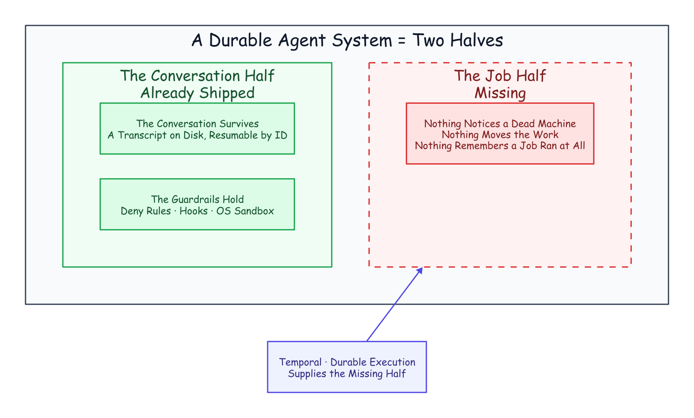
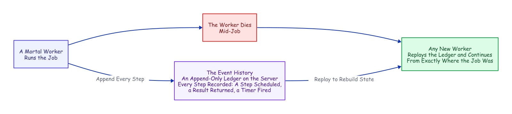
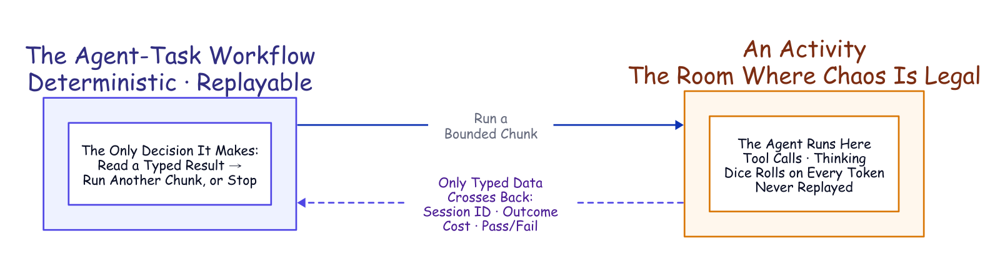
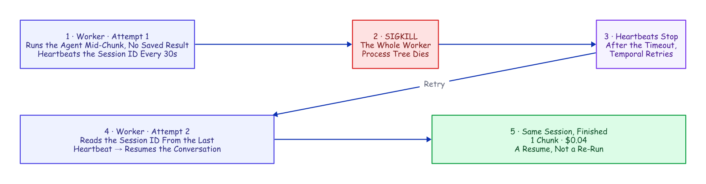

# A Crash-Proof Team of Coding Agents

### Claude Code remembers the conversation; Temporal remembers the job. Compose the two and you get a durable delivery team: nine single-purpose jobs carrying an issue from filed to merged, with Claude Code doing the judgment work inside them (building, reviewing, resolving) under skill playbooks, enforced hooks, and human-controlled settings on every retry. We SIGKILLed a worker mid-task and the run finished as the same session for four cents, resumed from its last heartbeat rather than any saved checkpoint; the team resolved a real merge conflict on the way, with no human decision in the loop.

---


There is a moment in every infrastructure demo where you stop trusting the slides and ask the presenter to pull the plug. We opened this project by pulling it ourselves. A long headless run of an AI coding agent (headless: one command in a terminal, no chat window) gets interrupted routinely anyway. A worker restarts, the API returns an overload error, a stream drops.

We killed the worker's whole process tree minutes into a task, with no completed result saved anywhere. A different process on a restarted worker picked up the same half-finished conversation and ran it to completion as the same session.

That is the durability half of this article, and it is the smaller half. The bigger half is what durability buys: a durable team of nine single-purpose jobs, one mandate apiece. One runs Claude Code itself and does all the judgment work: building the feature, reviewing the diff, resolving the conflict. The other eight carry the delivery pipeline around it. Each lane's agent runs under its team's skills (playbook files it discovers and invokes, not adjectives in a prompt) and under hooks and deny rules re-asserted before every chunk. A chunk is a bounded slice of a run, capped at a fixed number of turns. The team carried a filed GitHub issue to a merged pull request, resolving a real merge conflict, with no human decision in the loop. (One mechanical asterisk, footnoted where that story is told.)

*The fine print, up front: one engineer ran everything here, and the "we" throughout is editorial. The agent model in every measured run is `haiku`, Claude's cheap fast tier, in July and August 2026. The tasks are benchmark-sized and the run counts are single-digit, so every number is a point estimate, not a distribution. Every number also traces to an evidence file in the companion evidence repository (to be published soon), with the runners under `deploy/`. The dollar figures are haiku-priced, too: on a stronger model tier, every absolute number here scales up roughly an order of magnitude.*

## Claude Code Is Already Half a Durable System

Run Claude Code headless and it executes the whole agent, prints a result, and exits. The result carries a **session ID**: hand it back later with a resume flag and the agent reopens that exact conversation. That works because the transcript is an ordinary file on disk, filed under the directory the agent ran in. The *conversation* is already durable. Nor is this a toy mode: the official GitHub Action ships the same headless agent into continuous integration to review pull requests and fix failing checks.[^1][^2]

It also ships a real guardrail harness. Dangerous commands (deleting a tree, escalating privileges, pushing to a remote) are denied by the tool itself. Hooks fire around every tool call (one before it runs that can veto it, one after that records and reports it). The operating system sandboxes what the process can touch. And skills plus a required output schema shape what the agent does and returns.[^3] A line in a prompt is a suggestion; a deny rule is a fact, identical on the first attempt and the sixth.

That is one half of a durable system, the hard, conversational half. The other half its own documentation concedes: a resumed session is local to the machine and directory it was born in. There is no way to move it, no lease, nothing that notices the machine died and carries the work elsewhere.[^4] The agent remembers the conversation. **Nothing remembers the job.**


*Half a Durable System. The job, the thing that would notice a dead machine and move the work, is the piece left on the floor.*

## The Job Is the Half That Dies

The obvious way to drive a headless agent is a loop. Ask it to continue, refresh the session ID from the result, ask it to continue again:

```bash
while :; do claude -p "continue" --resume "$SID" --max-turns 6; done
```

The real thing parses each run's output to keep the session ID current, but that is the shape. It works right up until the process holding it dies. And when that process dies, exactly one thing survives, because it is a file on disk: the transcript. Everything else was memory. The current session ID. The retry count. The instruction someone typed an hour ago. The bare fact that a job was running at all.

An agent run is precisely the kind of job you cannot afford to forget. It runs for hours. It bills by the minute. It carries context it took real work to accumulate. It touches real systems. And it tends to fail while unattended. Remember it yourself and you end up hand-building durable state, a single-writer lock, a retry taxonomy, a liveness probe, and a status endpoint. Eventually you own a distributed system you never meant to design. Or you can give the job the one thing the conversation already has: a record that outlives the process.

## The Missing Half Has a Name

Strip the agent out of that hand-built list. What remains (durable state, one writer, retries, timeouts, liveness, visibility) is the standard checklist for any long job that must outlive its own hardware. The industry's name for the answer is **durable execution**. Temporal, the engine we used, grew out of a system built at Uber for exactly these long, crash-prone jobs.[^5]

The core move is a refusal to trust process memory. A database does not keep your data safe by keeping its process alive. It writes every change to a log and rebuilds after a crash by replaying it. Durable execution does the same for *program control flow*: every step a job takes is appended to a ledger on the server, the **event history**. Kill the process and a new one reads it back and continues from exactly where the job was.


*Durable Execution. The worker is disposable on purpose: any other worker replays the ledger and picks up mid-job. No memory snapshot required.*

The reconstruction is **deterministic replay**: re-run the job's code from the first line, substituting the recorded result at every step that already happened. Same code, same inputs, same decisions, same state. The catch lives in the word *same*: one clock reading, one coin flip, one network call in the replayed layer, and the replay diverges from its own history.

Three plain words carry the rest of this article. A **workflow** decides what a job does next: the deterministic, replayable layer that must never flip a coin. A **worker** is an ordinary, mortal process that does the work. An **activity** is a single step treated as a sealed box, free to call the network or roll dice because its insides are never replayed. It is retried under a declared policy. A running step can send **heartbeats**, liveness pulses that may carry a little data. If they stop for too long, the server declares that attempt dead and starts a retry that can read the last pulse the dead attempt sent.[^6]

That last capability is the mechanism the rest of this design rests on.

## Put the Agent Where Non-Determinism Is Legal

One problem looks fatal at first. A workflow has to be deterministic. An AI coding agent is the least deterministic software you will ever run: same prompt, different transcript, every time. Put the agent inside workflow code and the first replay diverges on the first token. That is a category error, not a knob you can tune.

But durable execution already has a room where non-determinism is expected: the activity. Seal the entire agent inside an activity and the workflow never sees the chaos. It sees only what crosses back as plain data: a session ID, an outcome, a dollar cost, a validated pass/fail report. Its own logic collapses to something a database could run: read a typed result, decide *continue or stop*, repeat.


*The Seam. The workflow stays replayable because the agent is sealed inside an activity; only typed data crosses the line.*

Two details make resume survive that boundary. First, each run gets one stable working directory derived from the job's identity, so every attempt lands in the same folder. That folder is where the agent filed its transcript: a retry can find the conversation again. Second, the workflow always chains forward the latest session ID an activity hands back, because a resume can mint a fresh one. The job's ledger stores a *pointer* into the conversation's transcript, and that pointer is very nearly the entire integration.

## Recovering a Crashed Run from Its Last Heartbeat

This is where the sealed box earns its place. While the agent works, a timer inside the activity fires a heartbeat every thirty seconds, no matter what the agent is doing. So a long, silent tool call cannot look like a dead worker. A wedged-but-pulsing agent is bounded by a separate ceiling on the whole chunk. Every pulse carries the latest known session ID, announced at the start of the run.

Kill the worker and the pulses stop. After the two-minute heartbeat timeout, the retry reads the session ID straight out of the dead attempt's last heartbeat and relaunches the agent with a resume. No completed checkpoint is required; the last heartbeat is the checkpoint.

That is the distinction worth naming, because it is the whole point. Every durable-execution engine can resume a *completed* step by replaying its recorded result. This resumes a *live* agent from an attempt that recorded nothing at all. The unit of recovery is not a finished step; it is a coding agent's conversation, caught mid-thought.


*Recovering a Crashed Run. Attempt 2 recovers the session ID from the dead attempt's final pulse. A re-read, not a re-run.*

We proved it the blunt way. Mid-task, the agent actively writing files, we killed the worker's **entire process tree** with an unblockable signal, leaving no completed result to fall back on. A restarted worker was already polling. After the timeout, Temporal retried the step, and the evidence is one line the recovered run left in its workspace:

```json
{"event": "resume_session_from_heartbeat", "attempt": 2,
 "input_session_id": null, "heartbeat_session_id": "698c432a-…"}
```

The input session ID is null: no completed chunk existed to hand back. The ID came *only* from the heartbeat. The run finished as the **same** session in one chunk, at $0.0404 total. That is not a recovery penalty, just the resumed session re-reading its own context at the cache rate and finishing the work.[^7]

Three things have to be right. **The heartbeat has to be recorded before the crash**: the SDK's default throttle on recording heartbeat details is too coarse for a short chunk. This project's worker tightens it on purpose.[^8] **The worker has to die as a whole group**: kill only the parent and the agent's child process is orphaned, finishes the work anyway, and *masks* the recovery. Our first recovery demos "succeeded" exactly this way, and they were lying before we caught it. **And the crash has to land while the chunk is genuinely in flight.**

The everyday value is less dramatic: what actually stops a headless run is the API, an overload, a rate limit, a dropped stream. Each becomes a typed, retryable failure whose backed-off retry (five seconds, doubling to a two-minute cap, six attempts) *resumes* the conversation. An overload window becomes added latency, not a failed run.

The same heartbeat, resume, and declared retries will carry a whole *team* of agents from a filed issue to a merged pull request. Every agent on that team runs inside the sealed box you just watched recover. Before the team, the bill for the box.

## What Durability Costs, in Three Numbers

We measured the whole bill (one task held constant across every scenario, small fast model, everything **observed rather than modeled**). Three numbers carry it. A continuous run costs about eleven cents. In numerals, with the honest spread, the three continuous runs cost $0.058, $0.132, and $0.149. Resuming after a crash adds about a third of a cent warm ($0.0035; a cold resume, about $0.021), because a resume only re-reads the accumulated conversation at the cache rate. The recovery you just watched is a re-read, not a re-run. And fine chunking is a sixty-three-fold spread: the same task cost $0.034, $0.25, and $2.13 on identical code. The cause was not any per-boundary cache tax but a tight turn cap changing what the model *does with its turns*. Hence the two defaults these numbers bought: big chunks, from the third; durability treated as effectively free, from the first two. One law compresses everything we measured and recurs through this whole family: **the mechanics cost cents; the behavior costs dollars.**[^9]

Durability is still insurance, and the threshold for buying it is the moment a task **outlives the process that started it**. The arithmetic (the method, the cold-resume probes, the bare-loop baseline, the experiment that fooled us once, the pricing canary that re-checks every number on a schedule, and when not to buy the insurance at all) is the economics companion, [*Mechanics Cost Cents, Behavior Costs Dollars*](mechanics-cost-cents.md).

## The Team, in One Breath

Everything above is one durable agent. The other half of this project is what happens when you scale that agent into a delivery team. The short version fits in a breath. The work is split into single-purpose durable activities (nine in the runs measured here, twelve in the repo today). Only one of them runs Claude Code, the judgment member you met in the opening breath of this article. The rest are plumbing with receipts: open the PR, push the branch, merge on a green verdict.

Each team is its own task queue on the workflow engine, with its own committed playbooks and the same retry and cost machinery as every other lane. **A worker is trusted by the queue it polls, not by the prompt it was handed.** What makes a team member is four files in version control (mandate, skills, hooks, stamped settings). None of it lives in the model.

The full anatomy (lanes and namespaces, the chunk mechanics, the audit plane, how a filed issue becomes a merged PR) is one click away in the engineering companion, [How It's Built](how-its-built.md). What belongs here is the one story that proves the team is real.

One more property makes the team compound rather than merely repeat: it learns from its own runs. When a job finishes, an activity exports the whole session conversation as a readable transcript, and every run ships its evidence (that transcript, the audit log of every tool call, the rule flags, the task board, the report) to a cloud bucket, one folder per run. That bucket is the corpus. The corpus gets mined (the repo calls this the learn-loop), and each lesson lands back in version control as a committed rule, skill, or gate; the export machinery and the mining walkthrough are in [How It's Built](how-its-built.md). The pattern has held from the first corpus mining (a written rule nudged the waste ~20% at best while the hook flagged twelve of twelve instances) to the latest fleet night. That night, the audit trail those hooks write was the record that debugged five live failures into five same-evening commits (`deploy/fleet-run-results.md`, `deploy/session-learnings.md`). A line in a prompt is a suggestion; a hook is a law. A mined corpus is how the laws get written. The system's job is not to avoid failure; it is to convert failure into a commit.

## The Conflict That Resolved Itself

We built a real target for it: a full-stack "snippets" web app, backend and frontend and browser tests, on a live deployment with a namespace per team and the poller on a schedule.

Two backend issues landed in the same poll window and collided by construction. One added search; the other added a delete endpoint. Both edited the same regions of the same backend file and its API contract. Each issue got its own branch, its own job, and its own pull request. The search PR merged first — and the moment it did, the delete PR (**PR #4**, the one this story follows) went stale: main had moved underneath it. This is where autonomy usually ends quietly: a "needs a manual rebase" comment, and a human inheriting the mess in the morning.


*The Conflict That Resolved Itself. Detection lives in the review lane; the fix lives in the lane that owns the code.*

Here is what happened instead, every step a durable activity in the history.

**The review lane approved PR #4 on its merits.** The code was fine; nothing about the *change* was wrong. But the *merge* was refused, because the platform will not merge a stale branch.

**The workflow tried the boring fix first.** Merge main into the branch and retry — the same "update branch" button a human would click. That is when the real problem surfaced: the two PRs had edited the same lines, so the update produced a **content conflict**. No amount of re-merging decides which side wins; someone has to read both changes and write the version that keeps both. That is a judgment call, and judgment is what the agent is for.

**So the review lane handed the conflict to the team that owns the code.** It read the issue number out of the branch name, looked up that issue's team — backend — and started a resolve job in the backend lane. The agent that picked it up was nothing special: same harness, same policy, only the prompt was different. It merged main into the branch, kept both the search feature and the delete endpoint, and ran the tests on the combined result: ten of ten green. Denied `git push` like every agent here, it left the pushing to the harness, which pushed the branch and merged it. *"Merge PR #4 (conflict auto-resolved)."* The issue closed itself a moment later.

Two properties keep this from being a party trick. The escalation cannot loop: the resolve job's ID is derived from the PR and its current head commit, so a duplicate start is refused by the server and cascading conflicts converge instead of multiplying. And it cannot cheat: the escalation is just a workflow starting another workflow, under the same crash recovery and hard limits as everything else.

Then the part that turns an incident into a system. A frontend issue had been sitting in the queue the whole time, marked *blocked by* the backend issue that just closed. The next poll noticed and released it. The frontend agent built a delete button against the very endpoint the resolution had just landed, added a browser test, and opened a pull request the review lane merged. From collision to shipped feature, the chain ran without a human decision in it, one mechanical asterisk included.[^10]

## What This Doesn't Solve

Six real gaps, told plainly, because the honest ones are the load-bearing ones.

- **Worker affinity.** The transcript and workspace are local files: the engine can recover the *workflow* anywhere, but a retried chunk has to land where the *session* lives. The repo now ships the sticky-queue fix (opt-in): the first chunk runs on the shared lane queue, reports its worker's stable per-worker queue, and the workflow pins every later chunk and the transcript export there, so a restart on the same host resumes correctly and a chunk never silently lands where the session is absent. The routing is unit-proven on the time-skipping server; the honest edge remains that a *permanently* dead machine took its local files with it, so true machine-loss still wants shared storage for the transcript and workspace. That multi-machine run is the receipt still owed. See [How It's Built](how-its-built.md).
- **The filesystem is not checkpointed, and steps run at-least-once.** A retried chunk resumes against a directory the dead attempt half-mutated. It converged in every test here, but *converges in practice* is not *idempotent by construction*. Outward actions want idempotency keys; the structural fix is a fresh git worktree per chunk.
- **A hard kill can orphan the agent.** The agent's child process may finish its chunk anyway, racing the retry: the exact effect that masked our first recovery attempts. Production workers belong in a process group or container that takes their children down with them.
- **Workflow code is a compatibility surface.** Replaying an old history against reordered code can wedge an in-flight run. Evolving an orchestration in production is a versioning discipline, not just editing a function.
- **A permissions landmine.** The agent's most permissive mode combined with resume in headless mode was broken upstream and has since been marked fixed.[^11] Re-check it against your version. This project sidesteps it with accept-edits plus an explicit allow-list.
- **The merge gate is an agent's verdict.** Approve-and-merge is gated on a single schema-validated boolean: the review agent's tests-pass verdict. Whether such a self-reported boolean can be believed is measured in a companion: it failed three times in ten, every miss a false alarm. None of those misses came from the isolated reviewer condition a real merge rides on ([*The Agent Grades Its Own Homework*](the-agent-grades-its-own-homework.md)). For this demo, that is the point; for production it is a placeholder. Insert your human gate exactly there: a protected branch or a durable approval step the workflow waits in. That approval step is built and verified against a live server. The companion piece [*The Human Is a Durable Object*](the-human-is-a-durable-object.md) is the walkthrough.

## Defaults Worth Stealing

If you build any version of this, on any stack, these are the settled defaults this project would hand you. Each one was paid for above.

- **Big chunks by default.** A tight turn cap is a slot machine: the same task ran $0.034 to $2.13 on identical code. Chunk for visibility and steering, never for durability.
- **Heartbeat a resume handle, not just liveness.** The last pulse is a free checkpoint; a retry that can read it never starts from zero.
- **Kill, and deploy, by process group.** An orphaned agent child finishes the work anyway and lies to you about whether your recovery works.
- **Deny `git push` to every agent.** The harness, with its own credentials, in its own recorded step, is the only hand that touches the outside world.
- **Route by queue, not by prompt.** A lane's queue and skill bundle are an identity a worker cannot drift out of; a persona in a prompt is not.
- **Deterministic job IDs, duplicates allowed only after failure.** Running and completed jobs are refused, so the poller needs no memory and the escalation loop cannot run away. Failed jobs may retry on a later sweep, so one transient error cannot deadlock an issue forever. (A live fleet run found the stricter refuse-everything version of this rule doing exactly that; `deploy/fleet-run-results.md` has the evidence.)
- **Write the rule as a hook, not a prompt.** Every time this project measured the two head-to-head, the rule was probabilistic and the hook was law. That held down to a rule losing outright to a direct instruction while the hook caught twelve of twelve. Priced at the tool boundary in [*Flag, Block, or Beg*](flag-block-or-beg.md) and at the finish line in [*Done Is Not a Claim*](done-is-not-a-claim.md).

## The Harness Was the Hard Part All Along

One practitioner teardown of Claude Code's own codebase estimates that roughly **1.6%** of it is the AI decision logic. The other **98.4%** is operational harness: permissions, state, recovery, tools.[^12] Set that next to the hand-build list from the start of this article and the overlap is hard to miss. The harness every agent team is rebuilding is, almost line for line, what durable-execution engines have provided for a decade.

The two sides are already circling each other. Temporal's own AI cookbook wraps model *API calls* in activities; a production write-up wraps the agent framework the same stateless way; another project built durable checkpointing around whole Claude Code runs on its own runtime.[^13][^14][^15] In the sources we checked, none composes the two the way this project does: headless Claude Code *sessions*. The session ID is carried in heartbeat details mid-chunk and in workflow state after a completed one. That claim has a short shelf life, so re-check it before you build.

But the composition is the natural one, and the seam really is small. Claude Code brings the durable conversation. Temporal brings the durable job. The agent could always remember the conversation; everything in this article is what became possible the moment something remembered the job.

---

*Disclaimer: the views and opinions expressed in this article are my own and do not necessarily reflect those of my employer. This is a personal project, not affiliated with or endorsed by Anthropic or Temporal.*

## Sources

- **Vendor documentation** for every Claude Code behavior cited (headless mode, sessions, the CI action, permissions, hooks, sandboxing) and every Temporal behavior (durable execution, activities, heartbeats and their throttling, versioning): code.claude.com/docs, docs.temporal.io, python.temporal.io; specifics footnoted inline. *Vendor/canonical.* Checked 2026-07-15.
- **Measured runs.** The heartbeat recovery, the conflict run, and the learn-loop are reproducible from the evidence repository (to be published soon): `deploy/heartbeat-recovery-results.md`, `deploy/conflict-run-results.md`, `deploy/learn-loop-results.md`, runners and analyzers under `deploy/`. Agent model `haiku`, July–August 2026. The cost measurements live with the economics companion, [*Mechanics Cost Cents, Behavior Costs Dollars*](mechanics-cost-cents.md).
- **Practitioner and adjacent sources** (the 1.6%/98.4% teardown, the Temporal AI cookbook, and the two adjacent durable-agent write-ups) are footnoted inline.

[^1]: Claude Code headless mode: `--output-format json` returns `session_id`, cost, and (with a JSON schema) structured output; `--resume <id>` continues a stored session; transcripts are stored under `~/.claude/projects/<cwd-slug>/<session-id>.jsonl`, the working-directory path with non-alphanumerics replaced. Checked 2026-07-15. *Vendor/canonical.*

[^2]: `anthropics/claude-code-action@v1` (GA) runs headless Claude Code on `pull_request`/cron and on `@claude` mentions, with automatic PR review; the docs note it is built on the Claude Agent SDK. Checked 2026-07-15. *Vendor/canonical.*

[^3]: Claude Code permissions are evaluated deny → ask → allow (a deny is unoverridable) and "enforced by Claude Code, not by the model"; `PreToolUse` hooks can deny a call before it runs, while `PostToolUse` hooks receive the completed event as JSON and report back; Bash sandboxing uses Seatbelt (macOS) / bubblewrap (Linux). Checked 2026-07-15. *Vendor/canonical.*

[^4]: Claude Code sessions: resume lookup "is scoped to the current project directory and its git worktrees"; there is no documented cross-machine session transport or leasing: the gap an external orchestrator must fill. Checked 2026-07-15. *Vendor/canonical.*

[^5]: Temporal docs: durable execution persists workflow progress as an event history; workflows must be deterministic so history replay reconstructs state; activities host side effects and are retried by policy; Temporal descends from Cadence, built at Uber. *Vendor/canonical.*

[^6]: Temporal Python SDK: `activity.heartbeat(*details)` sends heartbeat details, and `activity.info().heartbeat_details` exposes the previous attempt's details to a retry. The worker throttles how often details are persisted (`max_heartbeat_throttle_interval` / `default_heartbeat_throttle_interval`). Checked 2026-07-15. *Vendor/canonical.*

[^7]: `deploy/heartbeat-recovery.sh`, 2026-07-15: the worker's whole process tree was SIGKILLed mid-chunk before any completed result; attempt 2 recovered the heartbeat session ID (with the input session ID null) and relaunched with resume; it completed as one chunk, $0.0404, the same session. Requires a heartbeat throttle short enough to persist the ID, and a process-group kill so the agent child can't orphan-finish the work. One accounting honesty: whatever the dead attempt burned before the kill never returned a result, so it appears in no ledger; the figure is the surviving attempt's bill.

[^8]: With a heartbeat timeout set, the effective throttle is `min(heartbeat_timeout × 0.8, max_heartbeat_throttle_interval)`; the worker sets both throttle knobs from an environment variable (default 15s) so the in-flight session ID is recorded promptly. See `src/worker.py`.

[^9]: `deploy/full-experiment-results.md`, model `haiku`, 2026-07-15, run strictly sequentially, everything observed rather than modeled; the method and per-run detail are in the economics companion, [*Mechanics Cost Cents, Behavior Costs Dollars*](mechanics-cost-cents.md).

[^10]: The asterisk: PR #4 predated the escalation feature, so its review was re-triggered against the new code, and this run's polls were hand-triggered rather than waited out on the timer. The scheduled poll and the first-pass routing are proven across the other recorded runs; this run isolates the resolution chain. Evidence file: `deploy/conflict-run-results.md`.

[^11]: anthropics/claude-code#36139: bypass-permissions mode misbehaves with `--resume` in print mode; reported and marked resolved (re-check against your installed version). This project uses an accept-edits mode plus an allow-list plus workspace deny rules instead. *Vendor issue tracker.*

[^12]: *Dive into Claude Code* (arXiv 2604.14228): ~1.6% of the codebase is AI decision logic; ~98.4% operational harness. *Practitioner/academic.*

[^13]: Temporal AI cookbook: the "Basic agentic loop with Claude" uses model Messages API calls as activities; no Claude Code CLI, no session resume. *Vendor/canonical.*

[^14]: "Building fault-tolerant long-running AI workflows with Claude Agent SDK × Temporal.io," claudelab.net (2026-04-22): wraps API messages in activities; no headless sessions, no cross-activity resume. *Practitioner.*

[^15]: "Don't make Claude do the same work twice," zenml.io (2026-06-01): durable checkpointing of Claude Agent SDK runs on ZenML's own runtime, not Temporal. *Practitioner.*

