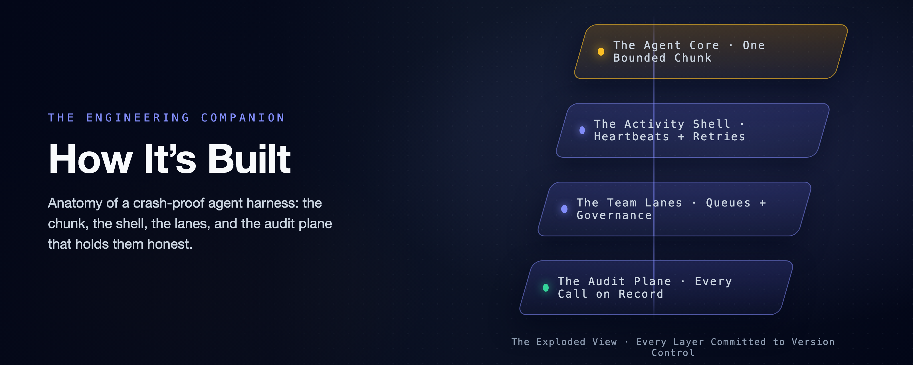

# A Crash-Proof Team of Coding Agents: How It's Built

### The engineering companion: the chunk mechanics, the lanes, the audit plane, and the detour we measured our way out of.

*This is the mechanism half. The claims and the fine print (one engineer, a cheap fast model, single-digit runs, point estimates) live in the [flagship](a-crash-proof-team-of-coding-agents.md). The cost measurements live in the economics companion, [Mechanics Cost Cents, Behavior Costs Dollars](mechanics-cost-cents.md). All of it applies verbatim here.*



---

Vocabulary, in one breath, for anyone arriving cold: this system runs headless Claude Code sessions under Temporal, a durable-execution engine. A **workflow** is the deterministic, replayable layer that decides what happens next. An **activity** is a sealed step that may do real-world work. A **chunk** is one bounded activity-run of the agent, capped at a fixed number of turns. A **heartbeat** is the liveness pulse a running activity sends. The flagship earns each of those words. This article spends them.

## How a Chunk Actually Runs

Open the box and one chunk is a single ordinary function. The workflow calls it, and the function runs the agent. What comes back is a typed record: a session ID, an outcome, a cost, a turn count, the validated report, and nothing else. That typing is the wall. The workflow can only read fields on that record, so nothing the agent did unpredictably has a path into the replayable layer.


*How a chunk ends. Three typed exits: resume, continue, or stop loudly. Nothing ends silently. Color key, used across this family: indigo = the durable machinery · amber = judgment (agent or human) · purple = the durable record · green = a good exit · red = failure · dashed = crosses a lane or a poll boundary.*

Launching the agent inside that function is a short list of settings, and one of them does the quiet heavy lifting. The agent is told to load its configuration from the project directory *only*, never from the machine's own user config. That single choice is why the policy below is true rather than hopeful. The rules ride inside the workspace, so the same agent runs on every worker on every machine. The rest read as you would guess. Resume the prior session. Cap the run at a fixed number of turns, so a chunk stops cleanly with its transcript intact. Auto-accept file edits, but gate every other tool behind an explicit allow-list. And force the closing report to match a schema, so the workflow reads a real pass/fail value instead of parsing prose.

The policy itself is a small settings file (`settings.json`). Humans control it. The rules live in version-controlled harness code, and the workspace re-stamps them fresh at the start of every chunk:

```json
{
  "permissions": {
    "deny": ["Bash(rm -rf:*)", "Bash(sudo:*)", "Bash(git push:*)"]
  },
  "hooks": {
    "PostToolUse": [
      { "matcher": "*", "hooks": [{ "type": "command", "command": "cat >> .claude/hook-log.jsonl" }] },
      { "matcher": "*", "hooks": [{ "type": "command", "command": "python3 .claude/flag-rules.py" }] }
    ]
  }
}
```

Read the deny list as architecture, not only safety. Deleting a tree and escalating privileges are the obvious entries. `git push` is the interesting one: the agent writes code and is never allowed to reach a remote. So every push and every merge in this entire system is done by the harness, in its own step, with its own credentials. The first hook appends every tool call to an audit log as it happens; the second flags a wasteful pattern a later experiment taught us to catch. And because the workspace rewrites this file before *every* chunk, the deny rules and the hooks are byte-for-byte the same on every attempt, through every retry and every resume. The guardrail cannot drift.

The settings file is only the smallest piece of what the workspace lays down. Each chunk also installs a set of **skills** (real playbook files the agent discovers and invokes through Claude Code's own Skill tool). It also installs a project memory, a `CLAUDE.md`, that points the agent at them. None of this is a bespoke protocol the agent had to be taught. It is a stock Claude Code project (settings, hooks, skills, memory), assembled fresh every chunk. The agent works inside it exactly as it would in any local checkout. Temporal does not replace that ecosystem; it decides when the project runs, where, and which skills come with it.

When a chunk fails, the function does not decide what to do about it. It raises a typed error and lets the workflow's retry policy handle the backoff. That policy is declared at the call site as configuration, not written as a loop. It is the same backoff that turns an overload window into added latency in the flagship's recovery story. It is tuned for the API failure a headless run actually meets rather than the rare crash. The plain GitHub steps around it get a plainer policy; a refused merge is not an overload.[^1]

The taxonomy under that is three-way, and it is very nearly the whole of the control logic. An API error or a mid-run failure is raised as *retryable*: the transcript survived, so the retry resumes the session instead of restarting the task. Running out of turns is not an error at all: the function returns normally and the workflow schedules the next chunk. Anything else terminal is raised as *non-retryable* and stops the job. Continue, resume, or stop: three outcomes a database could switch on, which was the entire point of sealing the agent away from the decision.

## The Detour We Measured Our Way Out Of

There is an older answer buried in this codebase, and it is worth showing precisely because it *worked*, until measurement talked us out of it.

An activity's result is all-or-nothing: nothing lands in the history until the attempt finishes. Wrap a ninety-minute agent run in one activity and a crash at minute eighty-nine erases everything the workflow could see. So the first design chopped the run into **savepoints** on that same turn cap. A capped run either finishes or runs out of turns mid-task, and in that second case the transcript survives, resumable by ID. Chain those together and you get a chunked session. Each activity runs one bounded piece, and every completed piece writes progress, cost, and the session ID into the history. It worked: we killed a worker in the middle of the second of four chunks on a real to-do-app build. It recovered on a restarted worker and finished all ten tests, one session end to end. (That was a savepoint-era run recorded in the lab notebook this project was curated from; the later kill with *no* completed chunk at all is the one with a receipt in the evidence repository.)


*The Savepoint Detour. The design was sound and the recovery was real. Two later facts retired it: heartbeat recovery survives a crash with no completed chunk at all, and cutting the run into many small pieces makes the bill unpredictable.*

But every completed-chunk boundary is another resume: an agent invocation that re-establishes the growing conversation before it does any new work. Once heartbeat recovery existed, those boundaries were buying a durability we already had. And they were quietly doing something worse to the cost, which is the part we did not see coming. Fine-chunking the same task later ran $0.034 to $2.13 on identical code, a spread driven by agent behavior rather than any cache tax. That measurement, and the experiment that fooled us before it, is the economics companion, [Mechanics Cost Cents, Behavior Costs Dollars](mechanics-cost-cents.md).

## Query, Steer, Cancel: What the Boundaries Are Still For

Completed-chunk boundaries did not stop being useful. They stopped being the durability mechanism. That freed them to be the *visibility and steering* cadence: the moments where the running job can answer to verbs a bare process cannot.

**Query it.** A read-only question, answered from the workflow's own state rather than from logs. Mid-run, a status query came back with the chunks completed so far, the running cost, and the live session ID. **Steer it.** A signal injected *"also add a stats subcommand, same test-driven treatment"* into a running to-do-app job; the workflow folded the instruction into the next chunk's prompt. And if a steer arrives during the very last chunk, it triggers one more, so late guidance is never silently dropped. **Cancel it.** Delivered on the next heartbeat; the activity tells the running agent to stop, so it exits cleanly instead of burning tokens as an orphan. The job lands in a canceled state you can see. (The query and steer demos are recorded in the lab notebook this project distills; the mechanisms themselves are a few dozen lines of workflow and activity code.)

So the turn cap has one clear rule: it sets how often the job reports in and can be redirected. Make it small only when a human needs to watch or steer the run in near-real time. Everything else in the left column of the table below is something you would otherwise have built by hand:

| What you would build by hand | The primitive that already exists |
|---|---|
| A session-ID file plus a lockfile | Job-ID uniqueness: one job *is* the session's single writer |
| A restart script plus a liveness probe | A heartbeat timeout plus a retry policy, declared not coded |
| A task-to-session map in memory and on disk | The session ID in heartbeat details mid-run, and in workflow state after a chunk |
| A hand-rolled taxonomy of which errors to retry | Typed retryable vs. non-retryable failures, with backoff |
| A status endpoint scraped from logs | A progress query plus the event-history UI |
| Steering a running task (never actually built) | A signal, folded into the next chunk's prompt |

## A Team of Activities

Everything so far makes *one* agent durable. The reason to bother is that the same machinery, pointed sideways, makes a *team* of them. That works because a durable job, unlike a bare process, can be given an owner, an address, and rules. And the durability does not thin out as the team grows. Every lane's agent runs inside the same crash recovery, the same resume-from-heartbeat, the same declared retries. So a nine-member team is nine durable specialists, not one durable conductor waving at fragile helpers.

Here is what we actually built. **Two workflows conduct the delivery team.** One is the durable task you have already met: it runs the agent in bounded chunks and then ships the result. The other is a scheduled poll that looks at a repository for new work, on a timer, as a durable job in its own right. And beneath those two conductors sits a **team of nine activities, each with exactly one job**. Nine in the measured runs; the repo now ships twelve, the fix-loop members having arrived after these runs. None of them is clever. Each is a sealed box that does one real-world thing and hands back typed data. That narrowness is the point: it is what lets the retries, the heartbeats, and the audit trail apply to every one of them for free.

![The Team of Activities: two workflows (the durable task and the scheduled poll) conduct a team of nine one-job activities grouped into three columns. The work and intake column runs the agent, exports the transcript, and scouts GitHub for work; the pull-request column opens the PR, posts the review verdict, and merges the approved PR; the conflict-repair column updates a stale branch, escalates a real conflict to the owning team, and pushes the resolved branch. Each step is a durable activity: retried, heartbeated, recorded](../../assets/diagrams/team-of-activities.png)
*The Team of Activities. Two workflows conduct nine one-job specialists. Read the columns as sub-teams: doing the work and finding it; the pull-request lifecycle; and repairing a conflict. Every box is a durable activity, so every box is retried, heartbeated, and recorded without anyone writing that code.*

Name the team by what each member does. One activity **runs the agent**: a single bounded, heartbeated chunk, the only member with any fire in its hands. One **exports the transcript** into a readable audit log once the work is done. One **scouts the repository** for new issues and pull requests and routes each to a team. Three handle the pull-request lifecycle: one **opens the pull request**, one **posts the review verdict** (approving only if the tests pass), one **merges** the approved change. And three handle the case where a merge fights back. One **updates a stale branch** by merging in the base and retrying. One **escalates a real conflict** to the team that owns the code. And one **pushes the resolved branch** so the merge can finally land. Nine specialists, two conductors, and a filed issue can travel the entire distance to a merged pull request while the humans sleep. And the shape should feel familiar. It is the discipline of a hardened CI/CD pipeline (gated merges, least-privilege credentials, an audit log on every step), applied to a team whose members are durable jobs.

The reason this is worth calling a *design* and not a script is that adding to the team is mechanical. Want a new capability (a security scan, a changelog write, a deploy)? You write one function that does the real-world thing and hands back typed data. You declare how it should retry. And you name the moment in the workflow where it runs. It inherits crash recovery, backoff, cancellation, and the audit trail from the harness, not from anything you wrote. The hard, distributed-systems parts are already solved; the only thing you add is the one honest step. That is the whole shape of "write the happy path and rent the rest."

## Trusted by the Queue, Not the Prompt

The team scales by giving each *kind* of work its own lane, and every "team" noun here is a concrete primitive underneath.

A **lane** is one Temporal namespace per team, with its own task queue and its own bundle of skills bound into the workspace before each chunk runs. (A namespace is an isolated partition of the Temporal server. The teams in these runs were backend, frontend, and review; the repo now ships six lanes, discovered from its `teams/` folders.) Workers listen only to the lane they own. And this is the part worth pausing on. A backend worker is trusted to do backend work not because its prompt says *act like a backend engineer*. It is trusted because it listens on the backend queue, runs under the backend skill bundle, emits backend audit artifacts, and answers to the same retry, cancel, query, and cost machinery as every other lane. **It is trusted by the queue it polls, not by the prompt it was handed.** The lanes are created from a script at startup, so the whole team topology lives in version control rather than being clicked into existence.

That skill bundle is not prompt flavor; it is a contract the lane owns. Each team's folder carries its mandate and its own copies of the disciplines it runs (test-first, review-your-own-diff, the required report format), tuned to the lane rather than cloned across it. The workspace binds to that folder live (the mandate is imported, the skills are linked), so the owning team's edits reach the very next chunk. Only the policy files are stamped per chunk as an immutable snapshot.

The load-bearing rule lives in those bundles: a change in one layer has to prove it did not break the others.

- A backend change is obliged to run the frontend and end-to-end suites too, not only its own.
- The review lane will not approve a pull request until that cross-layer evidence comes back green.

That is where *trusted by the queue* earns the phrase. The queue decides which bundle a worker runs, and the bundle decides what the worker is on the hook to verify. It is also what makes each activity a genuine team member rather than a costume. The lane's skills are the playbook it actually follows for the work, while an identical org-wide deny floor governs every lane. On top of that floor, each team commits its own watched rules, its own finish gate, and any extra denies it chooses (the review lane also denies `git commit`: reviewers read, they do not write). So a backend agent and a reviewer differ by discipline and by what their own team chooses to enforce, never by whether they are governed at all.

The formula for a team member, then, is short. **A mandate**: the one job it owns. **Skills**: the playbooks for how it operates. **Hooks**: the rules enforced on every tool call. **And a settings file stamped from human-committed harness code.** All four ride in version control; none of them lives in the model.


*Trusted by the Queue, Not the Prompt. Each team is a namespace with its own queue, worker, and skill bundle. The scheduled poll and the cross-lane escalation both reach another namespace the same small way: a client call made from inside an activity.*

The rest of the team's behavior falls out of a few more primitives. **Backpressure** is the queue itself plus a cap on how many chunks a single worker will run at once; you scale a hot lane by adding workers to it. **One owner per piece of work** comes from deriving each job's ID deterministically from the issue and starting it with an "allow duplicates only after failure" policy. A second attempt at a running or completed job is rejected by the server, while a failed job may retry on a later sweep. That single fact is *why* the poller can be completely stateless: re-seeing the same issue is a no-op the server refuses, so the poll keeps no memory of its own. And a transient failure heals itself instead of deadlocking the issue forever, a lesson a later fleet run taught the hard way. **Intake** is a Temporal schedule firing the poll workflow. So even "check the repo for work" is a durable, retried, observable job instead of a cron line that can silently die. And **sequencing** is a plain "blocked by #n" line the poller honors, holding a dependent issue until its prerequisite closes.

Adding workers to a lane surfaces the one place the design has to be careful, because the durability is not fully symmetric. Temporal can recover the *workflow* on any worker, but a chunk's session lives in *local files*: the transcript under the Claude projects directory keyed by the working directory, and the workspace under the temp directory keyed by the workflow ID. On a single-worker lane that is invisible. Put two workers on a lane and a resumed chunk could land on the worker that never held the session, and the resume finds nothing.

The fix is a **sticky per-worker queue**, opt-in so a single-worker lane is unchanged. Each worker listens on two queues: the shared lane queue, and its own stable queue named for the host (stable so it survives a process restart, which is exactly when the local files are still on disk). The first chunk runs on the lane queue, any worker takes it, and it reports its per-worker queue back as typed data. The workflow reads that off the chunk result and pins every later chunk and the transcript export to it, deterministically, because the queue name came across the seam like everything else. A restart on the same host now resumes on the right box, and a chunk can no longer silently land where the session is absent. The routing is proven on the time-skipping test server; the honest edge is that a *permanently* dead machine took its local files with it, so true machine-loss still wants shared storage for the transcript and workspace under the same key. That multi-machine run is the receipt still owed.

One structural catch shapes the whole picture. A workflow can only start child workflows inside its own namespace. Both the scheduled intake and the escalation below have to cross a namespace, and they do it the same modest way. From *inside an activity*, which is allowed to do arbitrary I/O, open a client to the target namespace and start the job there. The deterministic ID and the duplicate policy keep it idempotent even across that boundary.

## From Filed Issue to Merged PR

Put the conductors and the team together and one issue travels a full loop, every box along the way a durable step in the history.

![From Filed Issue to Merged PR: a comic-strip of seven steps. 1, a GitHub issue is filed and its label routes it to a team. 2, durable intake: a scheduled poll starts one durable job per ready item. 3, the issue lane's agent works in resumable chunks and opens a pull request. 4, the review lane reads the diff and approves only if the tests pass. 5, merging the PR self-heals a stale branch or hands a real conflict to the owning team. 6, the PR is merged and the issue closes. 7, the next poll releases the dependents the closed issue was blocking, and the loop closes](../../assets/diagrams/pipeline.png)
*From Filed Issue to Merged PR. Every box past the filed issue is a real activity from the team. The conflict detour and the unblock loop are not special cases; they are the same durable machinery running one more time.*

**Intake.** A schedule fires the poll on an interval. The poll reads the repository (open issues, open pull requests, and which issues have already closed). It routes each item to a team by its `team/…` label (or the catch-all lane when it carries none), and starts one durable job per ready item with a deterministic ID. An issue marked *blocked by* another (a line in its body or a `blocked-by` label) is held until that other issue closes.

**Build.** The issue's job runs the agent in bounded, resumable chunks, heartbeating its session ID the whole time. When the agent reports success, the transcript is exported to a readable audit log and a pull request is opened from the work branch.

**Review and merge.** That open pull request is picked up on the next poll and routed to the review lane as its own job. The agent reads the diff and runs the suite. Its verdict is a single field in the required report: a pass/fail boolean that *is* the merge switch. True posts an approval and merges the change; false requests changes. A merge against a branch that has fallen behind triggers an automatic branch update (the same "update this branch" move you would click in the GitHub UI) and a retry. And the false case does not have to be a dead end. With the optional fix loop on, a red verdict (or a human's Request Changes) hands the PR back to the owning lane to fix, re-validate, and re-review. It re-asks a human when the companion's human gate is also on, and it is bounded to a few rounds; the mechanics are in the [companion piece](the-human-is-a-durable-object.md).

**Escalate, resolve, unblock.** A retry that *still* conflicts is a genuine content collision, and it gets handed to the team that owns the code: a resolve job in that team's own namespace. There an agent merges in the base, fixes the conflict by hand, and runs the tests. Then the harness pushes the fixed branch and lands the merge. When that merge closes the issue, the next poll releases whatever was blocked on it, and the chain runs again for the dependent. No human decision anywhere in it.

## Every Run Leaves Evidence

Because the agent runs under a policy the workspace owns, every run leaves *two* planes of evidence, joined on one key: the session ID. Temporal owns the record of the **job**: every activity, attempt, failure, heartbeat timeout, signal, cancel, recorded cost, and session ID, queryable long after the run is over. The workspace owns the record of the **hands**. A hook appends every tool call to a log as it happens. A closing activity exports the whole conversation to readable Markdown, filed under the session ID. And the required pass/fail report is stored as typed data the workflow reads as a real value rather than a vibe.


*Every Run Leaves Evidence. Ask what the job did and you read Temporal's history; ask what the agent did and you read the workspace's package. One session ID ties them together, because the job is a durable object and not a vanished process.*

The policy rides *inside* the workspace, not on the machine, and its author is a human. The version-controlled configuration the workspace rewrites before every chunk is what keeps the deny rules, the hooks, and the skills identical across every worker, retry, and resume. One hygiene detail is worth stealing. The activity clones the repository with a token and then scrubs that token out of the remote, so the agent cannot recover the clone credential from the repo's own config. A companion detail runs the other way. Before any push, the harness excludes its own scratch (the configuration folder, the memory file, the report, every audit log) from the commit. So the control plane's policy and its paper trail never ride inside the product it ships. The agent writes the code; the control plane is the only thing that touches the outside world.

## The Corpus Improves the System

Every run exports its conversation (transcript, tool-call log, report). Once you collect those exports, you have a corpus of how your agents actually behave. Shipped to object storage, that corpus outlives any worker; the six runs behind the family's cost measurements went to a real bucket, one folder of evidence per run.[^2] A corpus is a feedback loop waiting to be closed, so we closed it. The loop has a shape worth naming: runs leave evidence, a review finds a mistake, the mistake becomes code, a re-run scores the fix, and the fix rides every future run. Nothing the system gets wrong is allowed to stay a lesson.


*The Corpus Improves the System. Runs become a corpus in a bucket; a reviewer finds a recurring waste; the lesson becomes a guardrail that rides every future run; a re-run scores it.*

A reviewer read the tool-call logs across all six runs and found one consistent waste: the agent kept re-checking work it had already done. It listed a directory to confirm a file it had just written (the write already proved the file exists), and re-ran tests that were already green. The leanest runs finished in eight or nine tool calls; the worst burned twenty-four, dominated by this re-checking. We codified the lesson two ways, both into the workspace bootstrap so they ride every future run and retry. One is a plain rule in the project's instructions ("trust your tools; don't list a directory to confirm your own work; run the suite once"). The other is a hook that deterministically flags any orientation-only directory listing.

Then we re-ran and scored the before and after, and the result is better than a clean win. The soft rule produced only a **modest ~20% drop** in the targeted pattern (from 2.5 to 2.0 instances per run on average, a half-instance change that sits within run-to-run noise). One run ignored it entirely. The total tool count did not fall at all (it in fact rose, from 15.5 to 18.5 calls per run), swamped by ordinary nondeterminism. The hook flagged **every remaining instance, twelve out of twelve**, regardless of whether the agent complied. The measurement makes the distinction precisely: the prompt rule is probabilistic, while the hook is deterministic. It is the same asymmetry the deny rules bought at the start of this article, now with numbers attached. It compresses to the one sentence we would keep if we could keep only one: **a line in a prompt is a suggestion; a hook is a law.** The useful result is not that the agent improved on average, but that the mistake is now caught on every run.

## The Family

- [A Crash-Proof Team of Coding Agents](a-crash-proof-team-of-coding-agents.md), the flagship: the kill, the team, the conflict that resolved itself
- [Mechanics Cost Cents, Behavior Costs Dollars](mechanics-cost-cents.md): every boundary priced; the family's cost ledger
- [Flag, Block, or Beg](flag-block-or-beg.md): the tool-call boundary, measured
- [Done Is Not a Claim](done-is-not-a-claim.md): the finish boundary, measured
- [The Agent Grades Its Own Homework](the-agent-grades-its-own-homework.md): the merge switch's boolean vs ground truth
- [The Human Is a Durable Object](the-human-is-a-durable-object.md): the human merge gate on four workflow primitives

---

*Personal project; views are my own and not my employer's. Not affiliated with
or endorsed by Anthropic or Temporal.*

[^1]: The workspace policy is human-committed in each team's folder — the deny rules, the two `PostToolUse` hooks, a `Stop`-hook phase gate added after these runs, and the lane's watched rules — and the harness stamps it into the workspace each chunk, injecting absolute-path denies that protect the team folders themselves. The project-only config load, the accept-edits mode with an explicit tool allow-list, and the schema-required report live in the chunk activity. The per-call retry policy (5s, doubling to a 2-minute cap, 6 attempts), the two-minute heartbeat timeout, and the fifteen-minute chunk ceiling are set where the workflow invokes the chunk.

[^2]: The learn-loop, 2026-07-15: the six cost-experiment runs' transcripts, tool logs, and reports were pushed to the corpus bucket; a reviewer identified redundant directory-listing re-orientation; the lesson was codified as a workspace instruction rule plus a `PostToolUse` flag hook; a re-run scored the modest rule effect and the deterministic hook (12 flags). Full results in the evidence repository.
