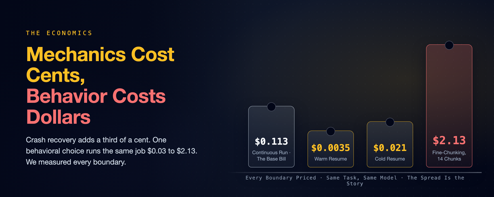

# Mechanics Cost Cents, Behavior Costs Dollars

### We measured every boundary of a crash-proof coding agent: an eleven-cent task, a third-of-a-cent crash recovery, and the same code running $0.03 to $2.13. The durability engine was measurably free. The agent's behavior was the bill.

*A companion to [A Crash-Proof Team of Coding Agents](a-crash-proof-team-of-coding-agents.md), a family of articles on running a team of Claude Code agents autonomously without setting your codebase on fire.*

---

*What Durability Costs (measured, small model). Left: a warm resume only re-reads context at the cache rate; a cold one pays a partial re-write. Right: fine chunking adds near-zero to two dollars, unpredictably.*

Put a durable-execution engine under a coding agent and it sounds like paying twice: once for the tokens, once for the machinery that babysits them. The [parent article](a-crash-proof-team-of-coding-agents.md) kills a worker mid-task and recovers the same session for four cents; this one is the ledger behind that number. We measured every boundary the harness has — the continuous run, the crash resume, warm and cold, the chunk seam, the no-engine baseline — and the pattern that fell out organizes everything this family has observed since: **the mechanics cost cents; the behavior costs dollars.**

*The fine print: model `haiku`, Claude's cheap fast tier, July 2026; benchmark-sized tasks; single-digit run counts. Every number is a point estimate, observed rather than modeled, and traces to an evidence file in the public repository, [thumarrushik/crash-proof-team-of-coding-agents](https://github.com/thumarrushik/crash-proof-team-of-coding-agents), runners under `deploy/`. Dollar figures are haiku-priced; a stronger tier scales them up.*

## How to Measure a Boundary Honestly

Total run cost is two terms: the agent's actual work, plus the overhead of any boundary you cross — a resume after a crash, a seam between chunks. The first term swings wildly (the same task takes the agent three turns or nine), so comparing totals across runs buries the boundary signal in noise. The estimator that works holds the work at **zero**: build a session to a fixed prefix, then resume it with a no-op — one turn, "reply OK, no tools" — and read the bill. Whatever that no-op costs *is* the boundary: the price of re-establishing the conversation, with the variance removed.¹

Everything below was run strictly one at a time, because an earlier batch taught us that lesson the hard way: concurrent runs contaminated each other's numbers. Cost is the CLI's own `total_cost_usd`, identical on a laptop or a cloud VM — a property of the API's prompt caching, not of the infrastructure.

## The Four Numbers

| Scenario | Measured | Mechanism |
|---|--:|---|
| **Continuous** — one session to done | **$0.113** | the floor: runs of $0.058 / $0.132 / $0.149 |
| **Crash, resumed warm** | **+$0.0035** | a cache *read* of the prefix, ~3% of the base |
| **Crash, resumed cold** (65 min idle) | **+$0.021** | a *partial* cache write, ~6× warm |
| **Fine-chunked** (2-turn cap) | **$0.034 – $2.13** | 1, 8, and 14 chunks: a ~63× spread |

Three of those four rows are cents, and they are the rows the durability machinery owns. A warm resume re-reads the accumulated conversation at the cheap cache-read rate: a third of a cent. That figure *is* the crash-recovery number — the heartbeat resume from the parent article is exactly this operation, and a live worker-kill confirmed it end to end at $0.0404 total on a separate task. Even the cold row undersells itself: after sixty-five minutes idle, the first touch paid a cache write on only *half* the prefix (14.9k of ~32k tokens) and then immediately re-warmed. Claude Code's extended-lifetime caching holds far past the classic five-minute window; the full cold penalty never materialized at all.²

The boundary tax also scales predictably, which is what makes it designable. It is linear in the prefix: about 0.1× the input rate warm, 1.25× cold. At the estimator session's 28k-token prefix a warm boundary is $0.003; projected onto a real long job's 470k prefix (live issue #41), a crash-resume is about five cents, ten back-to-back warm chunk seams about forty-seven cents — and ten *cold* seams about six dollars. The design rule falls out of the arithmetic: boundaries are nearly free exactly as long as they stay inside the cache lifetime. Space your chunks by hours and you convert every seam from a re-read into a re-write.³

## We Got This Wrong Before We Got It Right

The first chunking experiment concluded the opposite of the table above, and both results are still published, because the disagreement is the finding.

Round one, on a small fixed task: a first pass at n=3 showed fine chunking costing 68% more than coarse. **It did not replicate.** A clean n=6 came back cost-neutral — fine was, if anything, slightly cheaper (median $0.113 vs $0.145), and the biggest single bill in the batch was a *coarse* run that rambled to $0.79. Conclusion on that task: chunk granularity is a steering dial, not a cost lever.⁴

Round two, the same question asked of a more open-ended task: the neutrality shattered. The same code, fine-chunked, cost $0.034, $0.25, and $2.13 across three runs that took one, eight, and fourteen chunks. A sixty-three-fold spread; the worst run nineteen times the continuous base. And the per-boundary cache tax was *still cheap* — the seams themselves stayed at a fraction of a cent.

So what exploded? Behavior. A tight two-turn cap can send the agent to fourteen chunks and twenty-eight turns to finish what a continuous session did in nine: more turns, more output, and a growing prefix re-read at every seam. Coarse chunks never hand the agent that much room to wander. The chunking premium is real, *task-dependent*, and behavioral — which is why the earlier task, too small to wander in, measured it at zero. The rule this family ships as a default — **big chunks, always** — is not a guess about cache pricing. It is a guardrail against a slot machine.

Chunks still earn their keep at any size — they are where the workflow gets visibility, steering, and a place to stand between attempts; [Anatomy of a Crash-Proof Agent Harness](how-its-built.md) walks that anatomy. You chunk for control. You just never chunk for cost.

## The Baseline With No Engine at All

The fair comparison for all of this is the bare loop: the round-one task again, run as a plain headless `claude -p` — no Temporal, no workspace bundle, no resume. Nine trials: mean $0.175, median $0.172, range $0.05–$0.30 — a tie within noise with the durable coarse run on that task (median $0.145). **The engine adds approximately zero tokens.** (The bare loop skips the skill bundle but wanders more without it; the two effects roughly wash.)⁵

The difference is not the bill while things work; it is the bill when they break. The bare loop's session ID lives in process memory, so a crash costs a full re-run of everything the run had accumulated. The durable run pays the same bill and recovers for a third of a cent. A live end-to-end job — filed issue to merged pull request through the full team pipeline — confirmed the overhead in production shape: a clean eleven cents, zero retries. Durability, at these prices, is effectively free insurance on top of an identical premium.

## When You Should Not Buy the Insurance

Free insurance still is not for everything; you do not insure a cheap errand.

- **The task is cheap to re-run from scratch.** A one-chunk, two-minute job needs a retry button, not an engine.
- **One developer, one machine, interactive.** The transcript plus a resume by hand *is* the durability layer.
- **You would rather buy the orchestration than own it.** A managed agent runner is a legitimate answer to the same problem.

The threshold is crisp: the moment a task **outlives the process that started it** — an overnight run, a queue of issues, anything whose re-run from zero is a real bill — something has to remember the job, and the arithmetic above says remembering it costs cents.

## The Canary, Because Prices Are a Snapshot

Every number in this article leans on provider behavior that can change without notice: cache-read rates, cache lifetimes, resume semantics. "Effectively free" is a pricing snapshot, not an architecture property. So the repository treats its own published numbers the way an uptime monitor treats an endpoint: a scheduled **economics canary** re-probes five invariants — a session can be seeded; a same-model resume is a cheap cache *read*; a cross-model resume pays a cache *write* (caches are per-model: the handoff tax); a fork-resume stays cheap and mints a new session ID; a fork still recalls planted conversation memory — for about nine cents a pass.⁶

Its first flights independently reproduced the published numbers (warm resume $0.0030 live against $0.0035 published) and every probe landed in band. The bands are deliberately generous: this is a regime detector, not a price tracker. It alerts in *both* directions on the handoff tax, because a cross-model cache suddenly becoming free would be exactly the kind of silent regime change worth knowing about. When the economics under this article drift, the canary is designed to say so before the article does.

## Steal These

- **Measure boundaries with no-op resumes.** Totals across runs bury the signal in work variance; a zero-work resume *is* the boundary cost.
- **Run cost experiments strictly sequentially.** Concurrency contaminated a batch here; the discarded numbers were the tuition.
- **Big chunks by default; chunk for steering, never for cost.** The premium is behavioral, task-dependent, and unbounded in the wrong direction.
- **Keep chunk cadence inside the cache lifetime.** A warm seam is a 0.1× re-read; a cold one is a 1.25× re-write. The schedule, not the engine, decides which you pay.
- **Publish the superseded result next to its correction.** The n=3 artifact that did not replicate taught more than the clean run that did.
- **Canary your own published numbers.** Anything that leans on provider pricing is a claim with a decay rate; probe it on a schedule.

---

*Companion to [A Crash-Proof Team of Coding Agents](a-crash-proof-team-of-coding-agents.md). The runners, results, and the canary are reproducible from the public repository, [thumarrushik/crash-proof-team-of-coding-agents](https://github.com/thumarrushik/crash-proof-team-of-coding-agents). Disclaimer: the views expressed here are my own and do not necessarily reflect those of my employer. This is a personal project, not affiliated with or endorsed by Anthropic or Temporal.*

## Sources

- **The four-cost experiment** (continuous $0.113; warm $0.0035; cold $0.021 at 65 min; fine-chunked $0.034–$2.13 at 1/8/14 chunks): `deploy/full-experiment.py` / `deploy/full-experiment-results.md`, 2026-07-15, model `haiku`, strictly sequential. **Practitioner.**
- **The boundary estimator and prefix scaling** (no-op resume $0.00311; still-warm at 6.5 minutes; linear projection to a 470k prefix): `deploy/resume-cost.py` / `deploy/resume-cost-results.md`. **Practitioner.**
- **The superseded first experiment and the bare-loop baseline** (fine ≈ coarse on the small task; the n=3 +68% artifact; bare loop $0.175 mean ×9): `deploy/chunk-cost-results.md`, `deploy/bare-loop-cost.py`. Kept published with its correction header. **Practitioner.**
- **The live cross-checks**: the $0.0404 worker-kill recovery (`deploy/heartbeat-recovery-results.md`) and the $0.11 issue-to-PR pipeline job (`deploy/chunk-cost-results.md`). **Practitioner.**
- **The economics canary** (five probes, ~$0.09/pass, bands ~3× around published values, first three passes green): `src/canary.py`, `deploy/canary-results.md`, 2026-07-29. **Practitioner.**
- **Prompt caching and extended cache lifetimes**: code.claude.com/docs and Anthropic API documentation. *Vendor/canonical.* Checked 2026-07-15.

## Notes

1. `deploy/resume-cost.py`: one session built to a fixed ~28k-token prefix, then resumed with `--max-turns 1` and a no-tools instruction; the resume's `total_cost_usd` is the boundary tax with work variance held at zero. Same prefix every trial, so the numbers are tight ($0.00311 warm ×3, $0.00312 at 390 seconds ×3 — the 6.5-minute "cold" probe came back still warm, ratio 1.0×).
2. `deploy/full-experiment.py`, 2026-07-15, strictly sequential: continuous ×3 ($0.058/$0.132/$0.149, 3–9 turns, prefixes 84k–332k); warm boundary ×5 ($0.0035, all cache-reads, ~31k tokens); cold boundary ×3 after a 65-minute idle gap ($0.0206, a partial cache-write of 14.9k of ~32k tokens, then re-warmed); fine-chunked ×3 ($0.034/$0.25/$2.13 at 1/8/14 chunks). Full write-up: `deploy/full-experiment-results.md`.
3. Warm boundary ≈ 0.1 × prefix × input rate; cold ≈ 1.25 ×. At 28k: $0.003 warm. At the 470k prefix observed on live issue #41: ~$0.05 per warm resume, ~$0.47 for ten back-to-back warm seams, ~$5.88 for ten cold-spaced ones. `deploy/resume-cost-results.md` has the table.
4. `deploy/chunk-cost-results.md` (its header now marks it superseded): coarse median $0.145 (mean $0.248, range $0.091–$0.793), fine median $0.113 (mean $0.148, range $0.074–$0.344), n=6 each, after an n=3 first pass showing +68% failed to replicate. The $0.79 outlier was a coarse run that rambled into a second chunk — wandering, not boundaries, drove the spread even here.
5. `deploy/bare-loop-cost.py`, nine trials of the same task as a plain headless run: mean $0.1751, median $0.1719, range $0.05–$0.30, against the durable coarse run's $0.145 median — a tie within noise on these sample sizes.
6. `src/canary.py` and `deploy/canary-results.md`: five probes per pass, ~$0.09; first three passes $0.0941/$0.0932/$0.0938, all in band; live warm-resume $0.0030–0.0031 against the published $0.0035; the handoff tax $0.0632–$0.0638 live. Runs as a one-shot (`--once`, CI-able), a fixed Temporal Schedule, or a self-adjusting workflow whose cadence tightens on alerts and stretches on clean streaks. Daily cadence costs about $33 a year.
