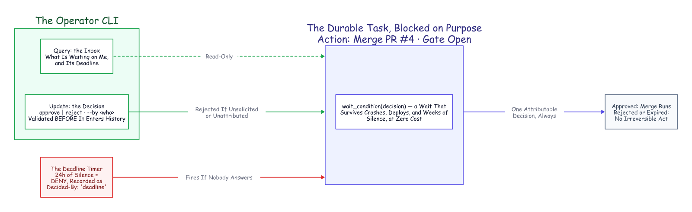

# The Human Is a Durable Object

### Green tests should not authorize a production merge; a person should. So we added one human decision to a team of autonomous coding agents, at the single moment that earns it: the merge. Not as a chat message that scrolls away, but as a place the durable job waits in, modeled on the workflow engine's own primitives and deny-safe when nobody answers. Then we ran it on a real local Temporal server until it passed ten checks out of ten. A companion to *A Crash-Proof Team of Coding Agents*.

---

*The Human Gate. The operator reads what is blocked through a query and answers through a validated update. If nobody answers, the deadline timer denies, attributably. Either path writes exactly one decision into the history.*

There is a class of action no amount of green tests should authorize on its own: the merge to a protected branch, the deploy, the spend past a threshold. The irreversible acts. The [main article](a-crash-proof-team-of-coding-agents.md) builds a team of coding agents that carries a filed issue all the way to a merged pull request with no human decision in the loop, and it gates that merge on one thing: a schema-validated boolean, the review agent's tests-pass verdict. For a demo repository that is the whole point. For anything that ships to people it is a placeholder.

So this companion adds a person, at exactly one moment, deliberately. Not with a notification, but with a place: a gate the durable job waits in, where even silence gets a name in the permanent record the engine keeps of everything the job did.

## Consent Is a State, Not a Message

Here is how the industry gates irreversible acts today, and why it leaks. A bot posts to a channel. An approval lives in somebody's direct messages. A chat prompt scrolls away. And the quiet killer: a timeout that means *ship it*, so every missed notification silently converts into consent.

The bug underneath all of that is a category error, and naming it is most of the fix. **Consent is being modeled as a message, when it is actually a state.** A message can be missed. A state can be *waited in*. And the durable-execution engine from the main article has machinery whose whole talent is waiting: a job that survives crashes, deploys, and long weekends while holding no thread, no connection, no worker slot. Point that at a human and the feature falls out of four primitives you already have.

## Four Primitives Make a Human

Every capability in the main article was built from the same small set of moves the workflow engine gives you for talking to a running job. Model the person on those same moves and the whole gate is a few lines.

**The human reads: a query.** A running job can already answer questions from its live state without touching a database. We added one: *what are you blocked on, and how long until your deadline?* Point a small operator command-line tool at the fleet and you have an approvals inbox assembled from the workflows themselves, with no side store to keep in sync.[^inbox]

**The human suggests: a signal.** Fire-and-forget advice. The operators in the main article could already inject "also add a stats subcommand" into a running job mid-flight; that is a signal, and it is perfect for steering. It is also structurally wrong for consent, for one reason worth saying out loud: a signal cannot say no to its sender, and it is never told whether it was even valid. Consent needs a channel that can refuse.

**The human decides: an update, with a validator.** This is the load-bearing choice. An update is synchronous and validated. The workflow inspects the decision before it enters the permanent record and can reject it outright, while the caller gets a definitive answer back instead of firing into the void. Ours rejects two things: a decision when no gate is open (you cannot approve something that is not asking), and a decision with no named decider. When either check fails, the code refuses to record it, so an unattributed approval never becomes history at all. Attribution is not a policy reminder here; it is enforced at the update boundary.[^decide]

**The human is waited for, with a deadline: a durable timer.** The heart of the gate is one call: wait until a decision exists, or until the clock runs out. Because the wait is a workflow primitive, it survives worker crashes and deploys, exactly as the main article's crash runs demonstrated for this same workflow, while holding no thread, no connection, no worker slot. A human's absence costs the system nothing. And when the deadline fires, the gate closes on the **deny** side and records a decision attributed to `deadline`, with a note saying how long it waited.[^gate] Six months later the history does not merely show that the merge did not happen. It shows that nobody answered, how long the system waited, and which policy closed the gate. Even silence gets a byline.

The gate defaults off. Autonomy stays the resting state of the whole system; accountability is one boolean on the job.

## We Ran It for Real

The main article's method is a rule: nothing it claims stays a claim if it can be measured. A human gate is a claim about *time and state*, so we ran the real workflow, the same one that runs the coding agent, against a real Temporal server running locally, drove it with the real operator tool, and read the real event history afterward. Four activities were stubbed: the agent chunk, the transcript export, the review post, and the merge, which are the leaf steps that spend tokens, reach GitHub, or read the session's own files from disk. The gate machinery itself is untouched, and every part of it is real.[^liverun]

Three scenarios, ten checks, all green.

| Scenario | The operator runs | Outcome | What the event history shows |
|---|---|---|---|
| **Approve** | `--approve <job> --by rushik` | the merge step fires (the stubbed call records the PR) | one accepted update; deadline timer armed but never fired |
| **Reject** | `--reject <job> --by rushik` | no merge | one accepted update; timer never fired |
| **Nobody answers** | nothing (a five-second deadline, for the test) | denied, no merge | zero human updates; the timer fired; decider recorded as `deadline` |

Read the last column, because it is the whole argument in one place. When a person decides, the history carries an accepted update with their name on it and the deadline timer sits unused. When nobody decides, there is no human update anywhere in the record and the timer fires instead, so the deny is attributed to the deadline rather than fabricated against a person. Before the approval, the inbox query listed the pending gate, exactly as an operator would see it. The difference between "she approved this" and "the clock ran out" is not a log line we chose to write. It is the shape of the recorded history.

## Two Things the Live Run Taught Us

Running it for real, rather than only in the time-skipping unit tests, surfaced two problems a green test suite had hidden. Both are in the record because the method requires it.

**A racing decision must be retried, not surfaced as a failure.** The very first live decision came back with a server error: the update had arrived in the same instant the workflow was processing another task, and the engine answered "not ready, try again." That is a transient, the workflow-engine equivalent of a busy signal, and a real operator tool should ride it out quietly. The command-line tool now retries that specific transient a few times before giving up, while still surfacing a *real* rejection (no gate open, no attribution) immediately, because that one is the answer, not a busy signal.[^retry]

**Do not freeze the waiter while you deliver the decision.** The demo harness ran the operator tool as a subprocess on the same thread that was hosting the worker, which briefly froze the worker exactly while it needed to apply the decision the subprocess was sending. The two blocked on each other until the attempt timed out. The fix was to deliver the decision off the worker's thread. It is a harness detail, not a property of the gate, but it is the kind of thing only a live run finds, and worth writing down so the next person does not lose an afternoon to it.

Neither bug was in the gate's logic. Both were in the plumbing around it, and both are the sort of failure the main article's whole thesis is about: the mechanism is small, and the operational harness around it is where the real work lives.

## Where It Plugs In

In the main system the gate sits at one place: the review lane, right after the agent posts its verdict and just before the merge. Approve, and the existing self-healing merge runs. Deny, or let the deadline deny for you, and the merge simply never happens, with the reason on the record. Turning it on is one field on the job; leaving it off keeps the fully autonomous behavior the main article demonstrates. It is the same gate you can drop in front of any irreversible act you choose: a deploy, a spend, a write to a protected branch.

## The Denial That Fixes Itself

A gate answers approve or deny, and there is a temptation to treat deny as the end of the line. It should not be. A denial that carries a reason is not a full stop; it is a request. So we closed that loop too. Like the gate, it is off by default; one flag turns it on.

When a pull request is not approved, it goes back to be fixed instead of just stopping. Three things count as not approved:

- the review agent's own test suite came back red;
- a human left a native "Request Changes" review on the PR;
- or a human denied at the merge gate with a note.

Any of the three hands the PR to the team that owns the code, whose agent reads the feedback, makes the change, re-runs the tests to validate it, and pushes. That push re-reviews the PR, and if the gate is on, re-opens it, so the human is asked again. Approve merges; another rejection fixes again. The loop is bounded: after a few rounds it stops, posts a comment that it is handing off, and waits for a person to take it.

One case is deliberately excluded, because the distinction is the whole point of the gate. A denial that came from the *deadline* never triggers a fix. A timeout is a safe stop, not a request for changes.

The shape is the same one the main article uses for merge conflicts, and it reuses the same idea: two small handoff steps, each a durable job in its own lane, one carrying the not-approved PR from the review lane to the owning lane to be fixed, the other carrying the fixed PR back to be re-checked and re-asked. The round number lives in each job's own ID, so the cap cannot be lost; a repeat start of a live or finished round is a no-op the server refuses, while a failed round may retry on a later sweep.

We ran the whole loop on a real server, the same way we ran the gate. The agent, the tests, the push, and the GitHub calls are stubbed, and the two handoff steps are stubbed to start their real sibling workflow on the same server; the workflows themselves, the human gate, and the operator CLI are real.[^fixloop]

| Step | What happens | Observed (stub-recorded) |
|---|---|---|
| Review, round 0 | the suite comes back red | not approved; no merge |
| Fix | the owning lane fixes it and re-runs the tests | one fix job started; the stubbed push records the branch |
| Review, round 1 | the re-review is green | the human gate opens |
| Approve | the operator approves at the gate | the stubbed merge records PR #4 |
| Cap | the round limit is hit on a still-red PR | no fix started; it waits for a human |

Seven checks, all green. The denial stopped being a dead end and became one more durable loop, bounded and attributable like everything else.

This is the last rung of the escalation ladder the main article climbs. Retrying harder is a machine's answer, and it tops out. For an irreversible act, or a task the strongest model still cannot land, the system's answer is to wait, durably and deadline-bounded, for someone accountable. The machines needed the whole article to become trustworthy participants. The human needed four primitives, because the durable record was already there.

## Steal These

- Model consent as a state to wait in, never a message to catch.
- Route decisions through a channel that can refuse them: validate before recording, and require a name.
- Timeouts are decisions too. Deny by default, and write the timeout into the record as the decider.
- Keep the gate off by default; put it only on the irreversible acts.
- A denial with a reason is a request, not a dead end: loop it back into a bounded, opt-in fix, but never loop a timeout.
- Test the time-and-state behavior on a time-skipping server, then run it once for real. The real run finds the plumbing bugs the unit tests cannot.

---

*Companion to [A Crash-Proof Team of Coding Agents](a-crash-proof-team-of-coding-agents.md). The gate, the operator tool, the live three-scenario run, and its evidence are reproducible from the public repository, [thumarrushik/temporal-claude-demo](https://github.com/thumarrushik/temporal-claude-demo). Disclaimer: the views expressed here are my own and do not necessarily reflect those of my employer. This is a personal project, not affiliated with or endorsed by Anthropic or Temporal.*

[^inbox]: The read side is a workflow query, `get_pending_approval`, returning the open gate or nothing; the operator inbox lists running jobs and queries each, in `src/approvals.py` (`--list`). No external database backs it.
[^decide]: The decision is a workflow update, `decide`, with a validator that rejects an update when no gate is open or when the decider is unnamed; the rejection happens before anything enters history. See `RunClaudeTask.decide` and its validator in `src/workflows.py`.
[^gate]: The wait is `workflow.wait_condition(lambda: decision is not None, timeout=...)`; on `asyncio.TimeoutError` the workflow synthesizes a denial attributed to `deadline`. See `_human_gate` in `src/workflows.py`.
[^liverun]: `deploy/hitl-live.sh` starts an ephemeral `temporal server start-dev` (with the Update API enabled) and runs `deploy/hitl-live.py`: the real `RunClaudeTask` workflow, the real query, update, validator, and timer, and the real `src/approvals.py` CLI. Four activities are stubbed (the agent chunk, the transcript export, the review post, and the merge) so the run needs no tokens and no live repo. Ten checks, all passing; full output in `deploy/hitl-live-results.md`. A time-skipping unit test, `tests/test_human_gate.py`, separately fast-forwards the 24-hour deadline in milliseconds.
[^retry]: The transient is the engine's `WorkflowNotReadyFailure` ("workflow task in failed state"), raised when an update races an in-flight workflow task; `src/approvals.py` now retries it a few times with a short backoff, while a genuine validator rejection (a `WorkflowUpdateFailedError`) is surfaced immediately.
[^fixloop]: The two handoffs are the `escalate_fix` (review lane to owning lane) and `escalate_review` (owning lane back to review lane) activities in `src/poller.py`, mirroring the conflict-resolution escalation; the round lives in the job source (`fix-pr-<n>-r<k>` / `pr-<n>-r<k>`) and is capped by `max_fix_rounds` (default 3). Off by default (`enable_fix_loop`). Covered by the time-skipping tests in `tests/test_fix_loop.py`; the live run is `deploy/fixloop-live.sh` (seven checks, all passing, `deploy/fixloop-live-results.md`).
